# Part - 1
## 4 AI Agent Patterns You Should Know
**reflection pattern** 
This pattern involves agents analyzing and improving their own performance. Agents use self-evaluation to refine their outputs and decision-making processes.
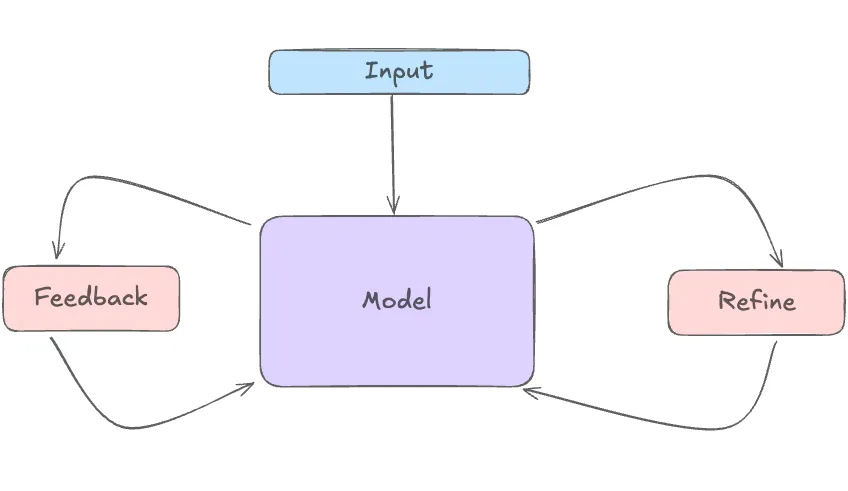

- self-refine, self-evalute

Here is how the pattern works:
**tool use pattenr**
Function Description: The LLM is provided with detailed descriptions of the available tools, including their purposes and required parameters.
Tool Selection: Based on the task at hand, the LLM decides which tool to use.
Function Calling: The LLM generates a special string to call the selected tool, typically in a specific format (e.g., JSON).
Execution: A post-processing step identifies these function calls, executes them, and returns the results to the LLM.
Integration: The LLM incorporates the tool’s output into its final responses.
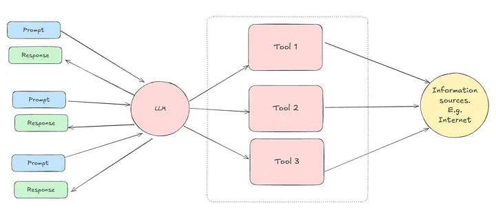

Düzeltme ve Açıklama

***Reflection Pattern şu şekilde çalışır:

AI ajan bir çıktı üretir
Üretilen çıktıyı değerlendirmek için kendi kendine kriterler uygular
Problemleri veya iyileştirme alanlarını tespit eder
Çıktıyı iyileştirir ve daha iyi bir versiyon üretir
Gerekirse bu döngüyü birkaç kez tekrarlar


Function Calling Pattern ise açıkladığınız şekilde çalışır:

Fonksiyonların tanımlanması
Uygun aracın seçilmesi
Fonksiyon çağrısının yapılması
Sonuçların yürütülmesi ve entegrasyonu***


**planning pattern**

- Task Decomposition: A LLM acts as a controller that breaks down a task into smaller, manageable subtasks.
- For each subtask, a specific model is chosen to perform the task.
- Specific export models execute the subtasks, and the result is given to the controller LLM, which generates a response.

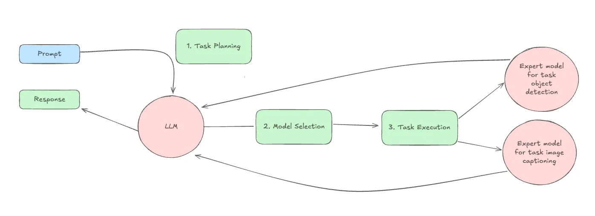

**mutli-agent collaboration pattern**

Specialized Agents: Each agent is designed to perform specific roles or tasks, such as a software engineer, a product manager, or a designer.
Task Decomposition: Complex tasks are broken down into smaller, manageable subtasks that can be distributed among the agents.
Communication and Coordination: Agents interact with each other, exchanging information and coordinating their actions to achieve common goals.
Distributed Problem Solving: The system uses the collective capabilities of multiple agents to address problems too complex for a single agent.

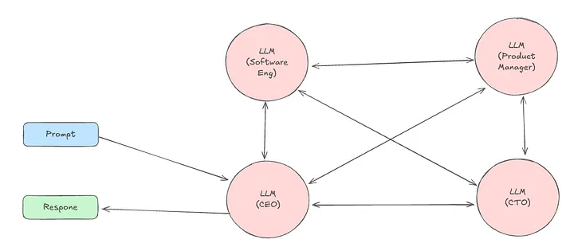


# Part - 2


| Type of Agent | Functionality | Complexity | Applications/Use Cases |
|--------------|--------------|------------|---------------------|
| Simple Reflex Agents | Operate based on condition-action rules | Low | Suitable for straightforward tasks where the response depends solely on the current percept. Basic customer service bots, simple automation tasks |
| Model-based Reflex Agents | Use internal model to track environment | Medium | Useful in partially observable environments. Examples include more advanced customer service bots that can handle follow-up questions and autonomous vehicles that need to keep track of moving objects. |
| Goal-based Agents | Consider future consequences to achieve goals | High | Suitable for complex decision-making tasks. Robotics, planning systems, advanced game AI |
| Utility-based Agents | Optimize performance based on utility function | Very high | Recommendation systems, financial trading systems, complex optimization problems |
| Learning Agents | Improve performance by learning from experiences | Very High | Adaptive game AI, personalized healthcare systems, fraud detection, autonomous vehicles |
| Multi-Agent Systems | Multiple agents interact to achieve common goals | Varies (Medium to Very High) | Transportation systems, robotics, social networks, e-commerce |

# Part - 3
agentic AI include four main perspectives, Planning, Memory, Tool, and Action.


- Planning: The agent will plan a workflow to achieve its goal. The plan includes but is not limited to reflection, self-criticism, chain-of-thought, and subgoal decomposition. To allow the agent to make a better plan, prompt engineering is the foundation for the agentic assistants to generate something closer to the expected result. Find more insightful example prompts from the blog post “How to Create an AI Assistant Without Any Coding Skills”. The planning process will be supported by the memory component to review the plan or previous subtasks in the workflow.
- Memory: The agent will have a memory component to store the previous actions or subtasks that may be needed in future planning or actions. The memories can be categorized into two types, short-term memory and long-term memory for storing data or previous task results with different dependencies.
- Tool: This refers to a set of tools, like a calendar, calculator, or code interpreter, that the agentic assistants acquire to perform specific tasks.
- Action: The agent takes action to complete the task assigned by the plan and make use of the tools equipped.

These four perspectives will run in a loop and form a cycle until the given task is completed. The process starts with planning, and equipping tools, followed by action, then memory, and then back to planning to start the next stage in the plan or another task.

- Agentic workflows represent sequences of well-defined jobs to be done that are executed dynamically by AI agents and orchestrated as part of a larger end-to-end business process automation.
- Agentic workflows, or agentic processes, put AI agents to work for task management and automation, bringing flexibility, responsiveness, and a degree of independence to business processes.

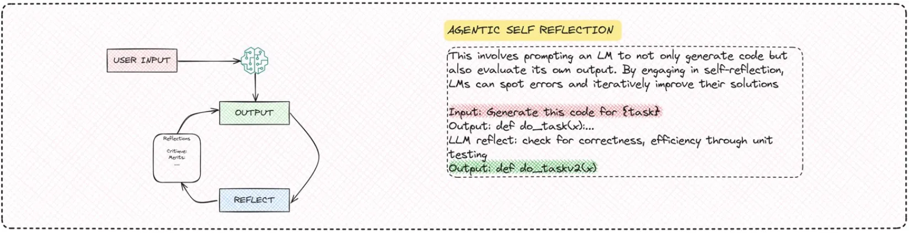

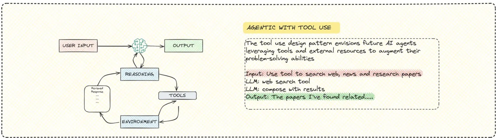

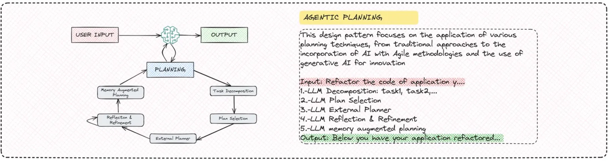

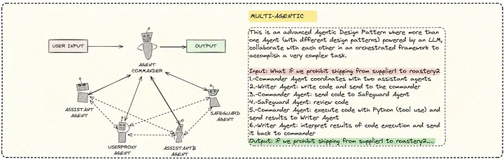


# Part - 4
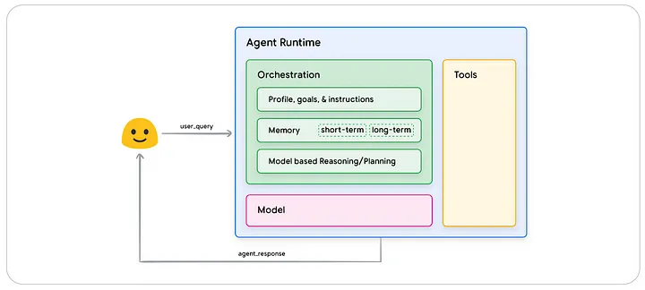

breakdown of how these architectures function:

- Cyclical Process: Agents operate in a cyclical fashion, continually taking in information, performing internal reasoning, and using that reasoning to decide on their next action. This cycle continues until the agent achieves its objective or reaches a defined stopping point.
- Orchestration Layer as the Core: At the heart of any cognitive architecture is the orchestration layer. This layer is responsible for maintaining the agent’s memory, current state, reasoning processes and overall planning.
- Reasoning Frameworks: The orchestration layer uses prompt engineering and specific frameworks to guide reasoning and planning. These frameworks help the agent to interact with its environment more effectively and complete tasks.


- There are three primary tool types for agents: Extensions, Functions and Data Stores.

- Think of extensions as pre-built connectors that allow an agent to easily interact with different APIs.

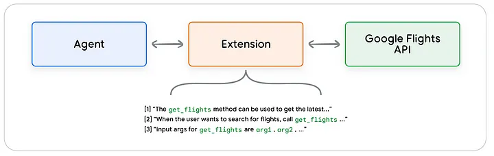

- Functions are self-contained modules of code that accomplish specific tasks and can be reused as needed, similar to how software developers use functions. 
- The key difference between functions and extensions is that functions are executed on the client-side, whereas extensions are executed on the agent-side.
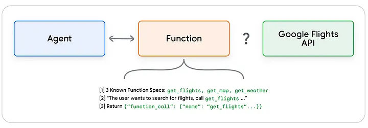

- Think of a data store as an external, updatable source of information that an agent can tap into.


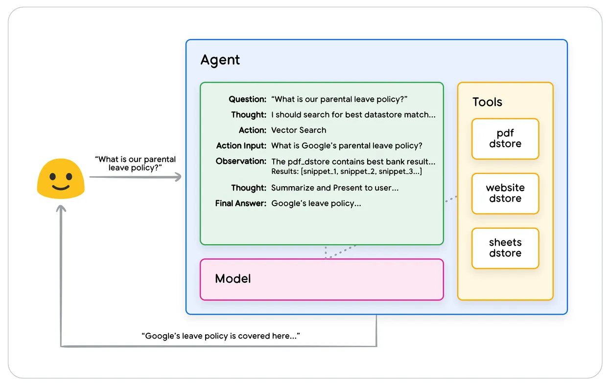

Targeted learning approaches focus on training or guiding AI Agents to make better decisions about which tools or resources to use in various situations. There are several approaches to achieve this:

- In-context learning: The model learns on the fly using prompts, tools, and few-shot examples at inference time. By presenting the model with carefully crafted prompts, including examples on when and how to use the tools, the model can understand the context and determine how to proceed.
- Retrieval-based in-context learning: This method enhances in-context learning by dynamically retrieving relevant information, examples, or tools from an external memory or database. The retrieved content is then included in the prompt during inference.
- Fine-tuning based learning: This involves training a model on a specific dataset that includes labeled examples of tool usage, decision-making processes, or reasoning steps. This updates the model’s weights, embedding the knowledge into the model itself. Unlike in-context learning, which relies on prompts, fine-tuning creates a permanent adaptation of the model.

```python

import os
from langgraph.prebuilt import create_react_agent
from langchain_core.tools import tool
from langchain_community.utilities import SerpAPIWrapper
from langchain_community.tools import GooglePlacesTool

# Setting up API keys
os.environ["SERPAPI_API_KEY"] = "XXXXX"
os.environ["GPLACES_API_KEY"] = "XXXXX"

# Define the search tool using SerpAPI
@tool
def search(query: str):
    """Use the SerpAPI to run a Google Search."""
    search = SerpAPIWrapper()
    return search.run(query)

# Define the places tool using Google Places API
@tool
def places(query: str):
    """Use the Google Places API to run a Google Places Query."""
    places = GooglePlacesTool()
    return places.run(query)

# Initialize the model
model = ChatVertexAI(model="gemini-1.5-flash-001")

# List of tools available to the agent
tools = [search, places]

# Query to ask the agent
query = "Who did the Texas Longhorns play in football last week? " \
        "What is the address of the other team's stadium?"

# Create the agent using the model and tools
agent = create_react_agent(model, tools)

# Input message structure
input = {"messages": [("human", query)]}

# Process the agent's response in stream mode
for s in agent.stream(input, stream_mode="values"):
    message = s["messages"][-1]
    if isinstance(message, tuple):
        print(message)
    else:
        message.pretty_print()
```
# Part - 5

Core Components of AI Agents
At its core, an AI agent is made up of the following components:

- Perception
- Reasoning
- Action
- Knowledge Base
- Learning
- Communication Interface
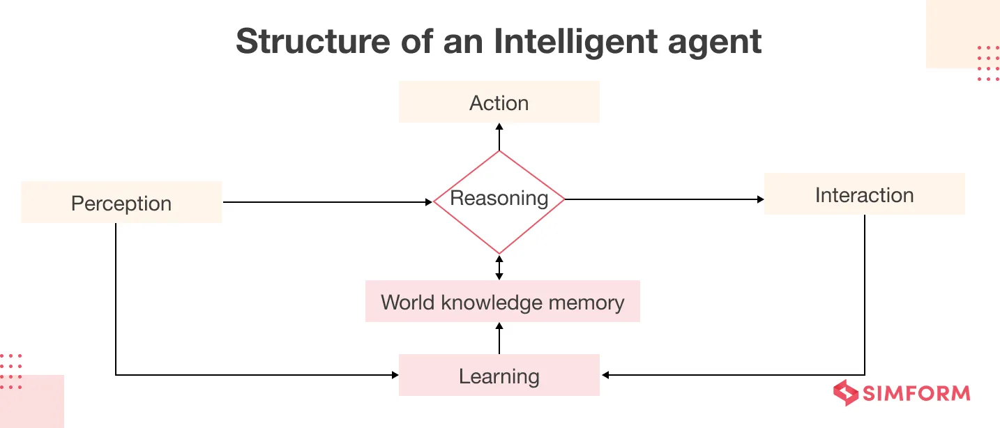


how ai agent work 
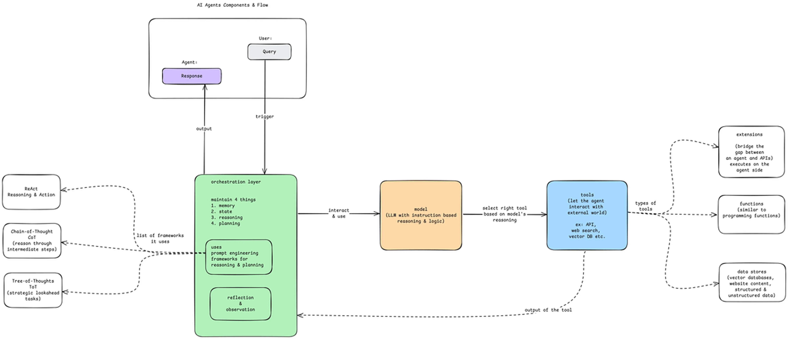

There are 4 major works of the orchestration layer:

Memory: maintaining the memory of your whole interaction.
State: storing the current state of the whole process.
Reasoning: guiding the agent’s reasoning.
Planning: what are the steps and what will be the next step?

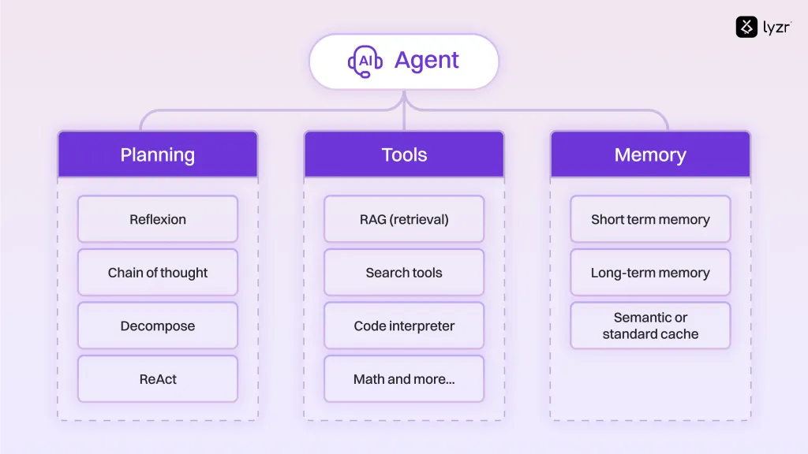

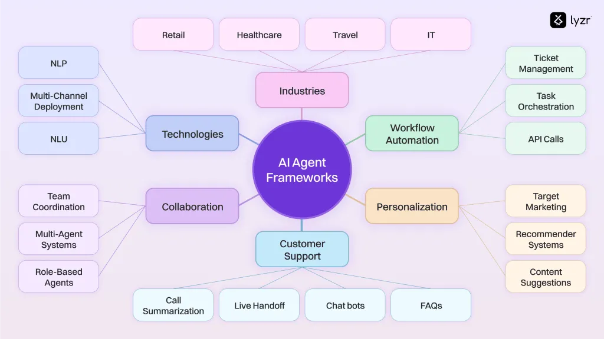

# Part - 6

 Agentic AI is a type of AI that’s all about autonomy. This means that it can make decisions, take actions, and even learn on its own to achieve specific goals. It’s kind of like having a virtual assistant that can think, reason, and adapt to changing circumstances without needing constant direction. Agentic AI operates in four key stages:

- Perception: It gathers data from the world around it.
- Reasoning: It processes this data to understand what’s going on.
- Action: It decides what to do based on its understanding.
- Learning: It improves and adapts over time, learning from feedback and experience.
 
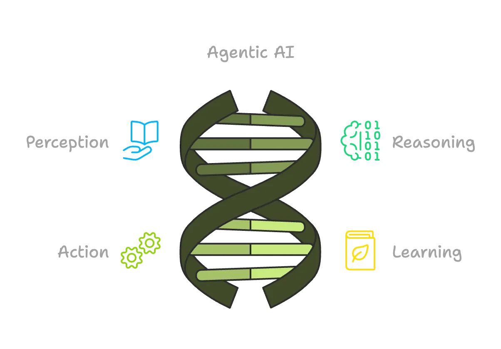

, AI Agents are typically built to do specific tasks. They’re designed to help you with something — like answering questions, organizing your calendar, or even managing your email inbox. AI Agents are great at automating simple, repetitive tasks but don’t have the autonomy or decision-making abilities that Agentic AI does.

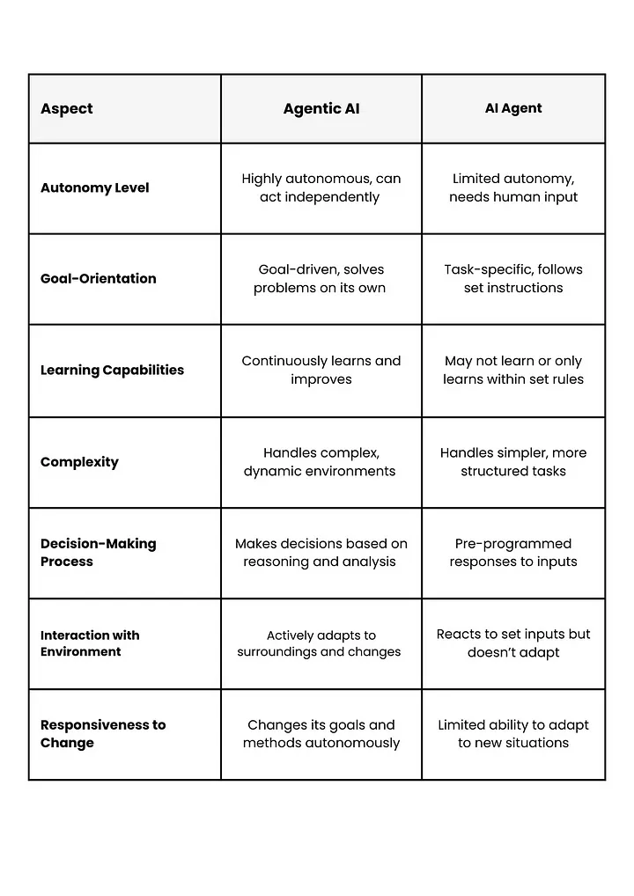