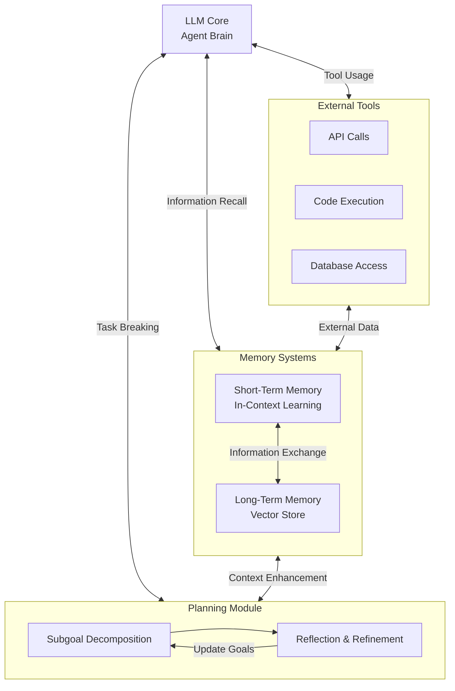

# agents_workspace

An LLM-powered autonomous agent system integrates several key components around a central LLM "brain":

1. Planning Module
   - Subgoal Decomposition:
     * Breaks complex tasks into smaller, manageable pieces
     * Creates hierarchical task structures
     * Enables parallel processing of subtasks
     * Helps manage task dependencies

   - Reflection & Refinement:
     * Analyzes past actions and their outcomes
     * Identifies successful and unsuccessful strategies
     * Updates approaches based on learned experiences
     * Implements continuous improvement loops

2. Memory Systems
   - Short-Term Memory:
     * Implements in-context learning
     * Maintains immediate task context
     * Handles recent interactions and information
     * Limited by context window size

   - Long-Term Memory:
     * Uses vector stores for persistent storage
     * Enables efficient information retrieval
     * Stores historical interactions and knowledge
     * Supports infinite information retention

3. Tool Integration
   - External API Access:
     * Retrieves real-time information
     * Accesses external services
     * Updates knowledge beyond training data
   
   - Code Execution:
     * Runs computations
     * Tests solutions
     * Validates outputs

   - Database Access:
     * Retrieves proprietary information
     * Manages structured data
     * Maintains persistent state

The system's effectiveness comes from how these components interact:
- Planning informs memory about what information to retain
- Memory provides context for better planning
- Tools augment both planning and memory capabilities
- The LLM orchestrates all components to achieve goals

## Research Papers

### Agent Fundamentals
- [A Survey on Large Language Model based Autonomous Agents](https://arxiv.org/pdf/2308.11432)
- [The Rise and Potential of Large Language Model Based Agents: A Survey](https://arxiv.org/pdf/2309.07864)

### Planning
- [Understanding the Planning of LLM Agents: A Survey](https://arxiv.org/pdf/2402.02716)

## Learning Resources

### General Agent Development
- [LLM Powered Autonomous Agents](https://lilianweng.github.io/posts/2023-06-23-agent/)
- [LLM Agents](https://www.promptingguide.ai/research/llm-agents)

- [AI Agent Workflows: A Complete Guide on Whether to Build With LangGraph or LangChain](https://towardsdatascience.com/ai-agent-workflows-a-complete-guide-on-whether-to-build-with-langgraph-or-langchain-117025509fa0)
- [LangGraph and Research Agents](https://www.pinecone.io/learn/langgraph-research-agent/#Graphs-for-Agents)
- [Agent Architectures - Blog](https://langchain-ai.github.io/langgraph/concepts/agentic_concepts/)
- [What is LangGraph?](https://www.analyticsvidhya.com/blog/2024/07/langgraph-revolutionizing-ai-agent/)
- [Build an LLM-Powered Data Agent for Data Analysis](https://developer.nvidia.com/blog/build-an-llm-powered-data-agent-for-data-analysis/)
- [How to Build a General-Purpose LLM Agent](https://towardsdatascience.com/build-a-general-purpose-ai-agent-c40be49e7400)

### React Agents

-[React Agent with Langraph](https://www.philschmid.de/langgraph-gemini-2-5-react-agent)

### Planning and Reflection
- [Planning for Agents](https://blog.langchain.dev/planning-for-agents/)
- [Literature Review on Task Planning with LLM Agents](https://isamu-website.medium.com/literature-review-on-task-planning-with-llm-agents-a5c60ce4f6de)
- [Reflection Agents](https://blog.langchain.dev/reflection-agents/)

### Flow Engineering
- [Flow Engineering is All You Need](https://medium.com/@rohanbalkondekar/flow-engineering-is-all-you-need-9046a5e7351d)
- [Flow Engineering: The Missing Piece in LLM App Development](https://medium.com/@filipkny/flow-engineering-the-missing-piece-in-llm-app-development-a27f2838328f)
- [Flow Engineering with LangChain/LangGraph and CodiumAI](https://www.youtube.com/watch?v=eBjxz7qrNBs)
- [Flow Engineering: Redefining AI's approach to problem-solving in software development](https://www.leewayhertz.com/flow-engineering/)
- [Flow Engineering is all you need!](https://div.beehiiv.com/p/flow-engineering-need)

### Multi-Agent Systems
- [LangGraph: Multi-Agent Workflow](https://www.youtube.com/watch?v=hvAPnpSfSGo)
- [Multiple AI Agents: Creating Multi-Agent Workflows Using LangGraph and LangChain](https://vijaykumarkartha.medium.com/multiple-ai-agents-creating-multi-agent-workflows-using-langgraph-and-langchain-0587406ec4e6)

### Langrahp
- [The Complete Guide to Building LangChain Agents](https://www.getzep.com/ai-agents/langchain-agents-langgraph)
  
## Example Implementations
- [Langraph Agent - Pinecone.io](https://github.com/pinecone-io/examples/tree/master/learn/generation/langchain/langgraph)
- [pydantic-airflow-agent](https://github.com/vojay-dev/pydantic-airflow-agent)
- [Creating an AI Agent That Uses a Computer Like People Do](https://levelup.gitconnected.com/creating-an-ai-agent-that-uses-a-computer-like-people-do-288f7ad97169)