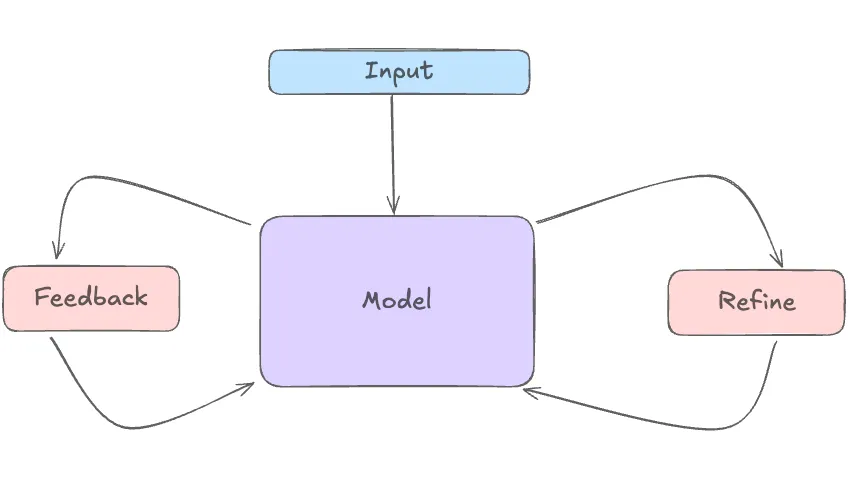
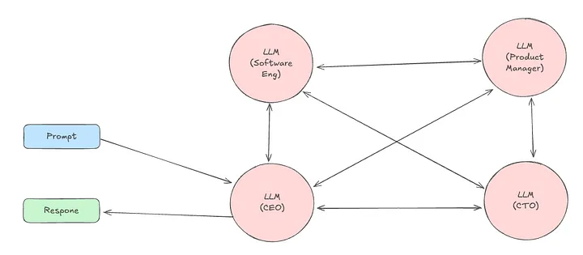
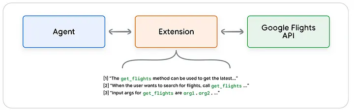

# Kapsamlı Yapay Zeka Ajanları Rehberi

## İçindekiler

- [1. Giriş: Yapay Zeka Ajanları ve Ajanlık AI](#1-giriş-yapay-zeka-ajanları-ve-ajanlık-ai)
- [2. Temel AI Ajan Desenleri](#2-temel-ai-ajan-desenleri)
  - [2.1. Yansıma (Reflection) Deseni](#21-yansıma-reflection-deseni)
  - [2.2. Araç Kullanımı (Tool Use) Deseni](#22-araç-kullanımı-tool-use-deseni)
  - [2.3. Planlama (Planning) Deseni](#23-planlama-planning-deseni)
  - [2.4. Çoklu Ajan İşbirliği (Multi-Agent Collaboration) Deseni](#24-çoklu-ajan-işbirliği-multi-agent-collaboration-deseni)
- [3. Yapay Zeka Ajan Türleri](#3-yapay-zeka-ajan-türleri)
  - [3.1. Basit Refleks Ajanları](#31-basit-refleks-ajanları)
  - [3.2. Model Tabanlı Refleks Ajanları](#32-model-tabanlı-refleks-ajanları)
  - [3.3. Hedef Tabanlı Ajanları](#33-hedef-tabanlı-ajanları)
  - [3.4. Fayda Tabanlı Ajanlar](#34-fayda-tabanlı-ajanlar)
  - [3.5. Öğrenen Ajanlar](#35-öğrenen-ajanlar)
  - [3.6. Çoklu Ajan Sistemleri](#36-çoklu-ajan-sistemleri)
- [4. Ajanların Temel Bileşenleri](#4-ajanların-temel-bileşenleri)
  - [4.1. Algılama](#41-algılama)
  - [4.2. Akıl Yürütme](#42-akıl-yürütme)
  - [4.3. Eylem](#43-eylem)
  - [4.4. Bilgi Tabanı](#44-bilgi-tabanı)
  - [4.5. Öğrenme](#45-öğrenme)
  - [4.6. İletişim Arayüzü](#46-iletişim-arayüzü)
- [5. Orkestrasyon Katmanı](#5-orkestrasyon-katmanı)
  - [5.1. Bellek Yönetimi](#51-bellek-yönetimi)
  - [5.2. Durum İzleme](#52-durum-izleme)
  - [5.3. Akıl Yürütme ve Planlama Çerçeveleri](#53-akıl-yürütme-ve-planlama-çerçeveleri)
- [6. Ajanlar İçin Araç Entegrasyonu](#6-ajanlar-için-araç-entegrasyonu)
  - [6.1. Uzantılar (Extensions)](#61-uzantılar-extensions)
  - [6.2. Fonksiyonlar (Functions)](#62-fonksiyonlar-functions)
  - [6.3. Veri Depoları (Data Stores)](#63-veri-depoları-data-stores)
- [7. Ajan Öğrenme Yaklaşımları](#7-ajan-öğrenme-yaklaşımları)
  - [7.1. Bağlam İçi Öğrenme (In-context Learning)](#71-bağlam-içi-öğrenme-in-context-learning)
  - [7.2. Erişim Tabanlı Bağlam İçi Öğrenme (Retrieval-based In-context Learning)](#72-erişim-tabanlı-bağlam-içi-öğrenme-retrieval-based-in-context-learning)
  - [7.3. İnce Ayar Tabanlı Öğrenme (Fine-tuning Based Learning)](#73-ince-ayar-tabanlı-öğrenme-fine-tuning-based-learning)
- [8. Ajanlık AI vs AI Ajanları](#8-ajanlık-ai-vs-ai-ajanları)
- [9. LangChain ve LangGraph ile Uygulama Örnekleri](#9-langchain-ve-langgraph-ile-uygulama-örnekleri)
  - [9.1. Basit ReAct Ajanı Oluşturma](#91-basit-react-ajanı-oluşturma)
  - [9.2. Fonksiyon Çağrılı Ajanlar](#92-fonksiyon-çağrılı-ajanlar)
  - [9.3. Çoklu Ajan Sistemi Oluşturma](#93-çoklu-ajan-sistemi-oluşturma)
- [10. Ajanlar İçin İleri Düzey Konular](#10-ajanlar-için-ileri-düzey-konular)
  - [10.1. Ajanlarda Bellek Optimizasyonu](#101-ajanlarda-bellek-optimizasyonu)
  - [10.2. Ajanlar Arası İletişim Protokolleri](#102-ajanlar-arası-iletişim-protokolleri)
  - [10.3. Dağıtık Ajan Sistemleri](#103-dağıtık-ajan-sistemleri)
- [11. Sonraki Adımlar ve Kaynaklar](#11-sonraki-adımlar-ve-kaynaklar)

## 1. Giriş: Yapay Zeka Ajanları ve Ajanlık AI

Yapay zeka (AI) alanında "ajan" kavramı, kendi ortamında algılama, karar verme ve eylem gerçekleştirme yeteneğine sahip yazılım veya sistemleri ifade eder. Bu sistemler, basit görevleri yerine getiren programlardan, kompleks problem çözme yeteneklerine sahip otonom sistemlere kadar geniş bir yelpazede bulunabilir.

Ajanlık AI (Agentic AI), bir adım daha ileri giderek özerklik kavramını vurgular. Bu tür yapay zeka sistemleri, kendi başlarına kararlar alabilir, eylemler gerçekleştirebilir ve belirli hedeflere ulaşmak için öğrenebilir ve adapte olabilir. Adeta bir sanal asistan gibi düşünebilir, mantık yürütebilir ve değişen koşullara uyum sağlayabilir.

Ajanlık AI dört temel aşamada çalışır:

1. **Algılama**: Çevredeki dünyadan veri toplanması
2. **Akıl Yürütme**: Bu verileri anlayıp ne olup bittiğini kavrama
3. **Eylem**: Anlayışına dayanarak ne yapacağına karar verme
4. **Öğrenme**: Geri bildirim ve deneyimlerden faydalanarak zaman içinde gelişme

## 2. Temel AI Ajan Desenleri

AI ajanları, çeşitli görevleri yerine getirmek için farklı desenler kullanır. Bu bölümde, dört temel ajan desenini inceleyeceğiz.

### 2.1. Yansıma (Reflection) Deseni

Yansıma deseni, ajanların kendi performanslarını analiz ederek iyileştirmelerini sağlayan bir yaklaşımdır. Ajanlar, çıktılarını ve karar verme süreçlerini iyileştirmek için öz-değerlendirme yaparlar.



**Yansıma Deseni Nasıl Çalışır**:

1. AI ajan bir çıktı üretir
2. Üretilen çıktıyı değerlendirmek için kendi belirlediği kriterleri uygular
3. Problemleri veya iyileştirme alanlarını tespit eder
4. Çıktıyı iyileştirir ve daha iyi bir versiyon üretir
5. Gerekirse bu döngüyü birkaç kez tekrarlar

Bu desen, özellikle karmaşık ve yüksek kalite gerektiren görevlerde (programlama, yazı yazma, analiz yapma vb.) ajanın sürekli olarak kendini iyileştirmesini sağlar.

### 2.2. Araç Kullanımı (Tool Use) Deseni

Araç kullanımı deseni, ajanların yeteneklerini genişletmek için harici kaynakları kullanmasını sağlar. Bu desende, ajan verilen görev doğrultusunda hangi aracı kullanacağına karar verir ve o aracı çağırarak sonuçları entegre eder.


**Araç Kullanımı Deseni Nasıl Çalışır**:

1. **Fonksiyon Tanımlaması**: LLM'e mevcut araçların detaylı açıklamaları ve gereken parametreleri sağlanır
2. **Araç Seçimi**: Ajan, eldeki göreve göre hangi aracı kullanacağına karar verir
3. **Fonksiyon Çağrısı**: Ajan, seçilen aracı çağırmak için özel bir format (genellikle JSON) kullanarak bir string oluşturur
4. **Yürütme**: İşlem sonrası bir adım bu fonksiyon çağrılarını tanımlar, yürütür ve sonuçları LLM'e geri döndürür
5. **Entegrasyon**: LLM, aracın çıktısını son yanıtlarına entegre eder

Bu desen, LLM'lerin hesaplama yapma, internet araştırması yapma, API'lerle etkileşim kurma gibi kendi başlarına yapamadıkları işleri gerçekleştirmelerine olanak tanır.

### 2.3. Planlama (Planning) Deseni

Planlama deseni, karmaşık görevleri daha küçük, yönetilebilir alt görevlere ayırarak çözmeyi hedefler. Bu desende, bir kontrolör LLM görevi parçalara ayırır ve her parça için en uygun modeli seçer.


**Planlama Deseni Nasıl Çalışır**:

1. **Görev Ayrıştırma**: Bir LLM, kontrolör olarak görev yaparak karmaşık bir görevi daha küçük, yönetilebilir alt görevlere ayırır
2. **Model Seçimi**: Her alt görev için, o görevi yerine getirmek üzere belirli bir model seçilir
3. **Görev Yürütme**: Seçilen uzman modeller alt görevleri yerine getirir ve sonuç kontrolör LLM'e verilir
4. **Yanıt Oluşturma**: Kontrolör LLM, tüm alt görevlerin sonuçlarını bir araya getirerek nihai bir yanıt oluşturur

Bu desen, "divide and conquer" (böl ve yönet) stratejisini uygulayarak karmaşık problemleri çözmek için idealdir. Her alt görev için, o konuda uzmanlaşmış farklı modeller kullanılabilir.

### 2.4. Çoklu Ajan İşbirliği (Multi-Agent Collaboration) Deseni

Çoklu ajan işbirliği deseni, farklı rollere sahip uzmanlaşmış ajanların birlikte çalışarak karmaşık problemleri çözmesini sağlar. Her ajan kendi uzmanlık alanında görev alarak, tek bir ajanın yapamayacağı karmaşık işleri tamamlayabilirler.



**Çoklu Ajan İşbirliği Deseni Nasıl Çalışır**:

1. **Uzmanlaşmış Ajanlar**: Her ajan, yazılım mühendisi, ürün yöneticisi veya tasarımcı gibi belirli roller veya görevleri yerine getirmek üzere tasarlanmıştır
2. **Görev Ayrıştırma**: Karmaşık görevler, ajanlar arasında dağıtılabilecek daha küçük, yönetilebilir alt görevlere ayrılır
3. **İletişim ve Koordinasyon**: Ajanlar birbirleriyle etkileşime girerek bilgi paylaşır ve ortak hedeflere ulaşmak için eylemlerini koordine eder
4. **Dağıtık Problem Çözme**: Sistem, tek bir ajanın çözemeyeceği kadar karmaşık sorunları ele almak için birden fazla ajanın kolektif yeteneklerini kullanır

Bu desen, insan ekiplerindeki işbirliğini taklit ederek, farklı bakış açıları ve uzmanlıklar gerektiğinde özellikle etkilidir. Örneğin, bir CEO rolündeki ajan, diğer uzman ajanlara görevler atayabilir ve sonuçları koordine edebilir.

## 3. Yapay Zeka Ajan Türleri

Yapay zeka ajanları, karmaşıklık ve yeteneklerine göre çeşitli türlere ayrılır. Bu bölümde, farklı ajan türlerini ve bunların uygulamalarını inceleyeceğiz.

### 3.1. Basit Refleks Ajanları

Basit refleks ajanları, koşul-eylem kurallarına göre çalışan en temel ajan türüdür. Bu ajanlar, mevcut algılarına dayanarak doğrudan eylemde bulunurlar, geçmiş veya gelecek düşünülmez.

**Karmaşıklık**: Düşük

**Uygulamalar/Kullanım Alanları**:
- Yanıtın yalnızca mevcut algıya bağlı olduğu basit görevler için uygundur
- Temel müşteri hizmetleri botları
- Basit otomasyon görevleri

**Örnek**: Bir termostat, oda sıcaklığını algılar ve belirli bir eşiğin altındaysa ısıtıcıyı açar, üstündeyse kapatır. Geçmiş sıcaklık verileri veya gelecekteki tahminler dikkate alınmaz.

### 3.2. Model Tabanlı Refleks Ajanları

Model tabanlı refleks ajanları, ortamın iç durumunu takip etmek için bir model kullanır. Bu model, ajanın kısmen gözlemlenebilir ortamlarda daha iyi performans göstermesini sağlar.

**Karmaşıklık**: Orta

**Uygulamalar/Kullanım Alanları**:
- Kısmen gözlemlenebilir ortamlarda faydalıdır
- Takip soruları cevaplayabilen daha gelişmiş müşteri hizmetleri botları
- Hareketli nesneleri takip etmesi gereken otonom araçlar

**Örnek**: Bir sürücüsüz araç, diğer araçların hızını ve yönünü gözlemleyerek onların gelecekteki konumlarını tahmin eden bir model kullanabilir. Bu, aracın trafik akışına uyum sağlamasını ve güvenli bir şekilde navigasyon yapmasını sağlar.

### 3.3. Hedef Tabanlı Ajanları

Hedef tabanlı ajanlar, belirli bir hedefe ulaşmak için eylemlerinin gelecekteki sonuçlarını değerlendirir. Bu ajanlar, "ne olursa" düşüncesine sahiptir ve hedeflerine ulaşmak için en iyi eylemleri seçerler.

**Karmaşıklık**: Yüksek

**Uygulamalar/Kullanım Alanları**:
- Karmaşık karar verme görevleri için uygundur
- Robotik sistemler
- Planlama sistemleri
- Gelişmiş oyun yapay zekası

**Örnek**: Satranç oynayan bir yapay zeka, her hamlede birçok olası hamleyi değerlendirir ve kazanma hedefine ulaşmak için en iyi stratejiyi seçer.

### 3.4. Fayda Tabanlı Ajanlar

Fayda tabanlı ajanlar, fayda fonksiyonlarına göre performanslarını optimize eder. Bu ajanlar sadece hedefe ulaşıp ulaşmadıklarını değil, hedefe ne kadar iyi ulaştıklarını da değerlendirirler.

**Karmaşıklık**: Çok Yüksek

**Uygulamalar/Kullanım Alanları**:
- Öneri sistemleri
- Finansal ticaret sistemleri
- Karmaşık optimizasyon problemleri

**Örnek**: Bir film öneri sistemi, kullanıcının geçmiş izleme alışkanlıklarına, derecelendirmelerine ve benzer kullanıcıların tercihlerine dayanarak, kullanıcının en çok beğeneceği filmleri önermek için fayda fonksiyonunu optimize eder.

### 3.5. Öğrenen Ajanlar

Öğrenen ajanlar, deneyimlerinden öğrenerek performanslarını iyileştirir. Bu ajanlar, zaman içinde çevrelerini daha iyi anlamak ve daha etkili eylemler gerçekleştirmek için çevrelerinden geri bildirim alırlar.

**Karmaşıklık**: Çok Yüksek

**Uygulamalar/Kullanım Alanları**:
- Adaptif oyun yapay zekası
- Kişiselleştirilmiş sağlık sistemleri
- Dolandırıcılık tespiti
- Otonom araçlar

**Örnek**: Dil modelleri, kullanıcı geri bildirimleriyle ince ayar yaparak, zaman içinde daha doğru ve yararlı yanıtlar üretmeyi öğrenebilir.

### 3.6. Çoklu Ajan Sistemleri

Çoklu ajan sistemleri, ortak hedeflere ulaşmak için birden fazla ajanın etkileşime girdiği sistemlerdir. Bu sistemlerde ajanlar işbirliği yapabilir, rekabet edebilir veya problem çözmek için müzakere edebilir.

**Karmaşıklık**: Değişken (Orta - Çok Yüksek)

**Uygulamalar/Kullanım Alanları**:
- Ulaşım sistemleri
- Robotik
- Sosyal ağlar
- E-ticaret

**Örnek**: Trafik yönetimi sisteminde, birden fazla ajan trafik ışıklarını kontrol ederek ve bilgi paylaşarak trafik akışını optimize edebilir.

## 4. Ajanların Temel Bileşenleri

AI ajanlarının temel yapı taşları, onların çevrelerini algılamalarını, bilgi işlemelerini ve akıllı eylemler gerçekleştirmelerini sağlayan bileşenlerdir. Bu bölümde, bir AI ajanının temel bileşenlerini detaylı olarak inceleyeceğiz.


### 4.1. Algılama

Algılama, ajanın dış dünyadan veri toplamasını sağlayan bileşendir. Bu, ajanın çevresi hakkında bilgi edinmesinin ilk adımıdır.

**Algılama Örnekleri**:
- Metinsel girdileri anlama
- Görüntü verilerini işleme
- Sensör verilerini okuma
- Ses tanıma
- API'lerden veri çekme

Algılama yeteneği, ajanın ne kadar "farkında" olduğunu belirler. Daha gelişmiş algılama mekanizmaları, ajanın daha çeşitli ve karmaşık verileri işleyebilmesini sağlar.

### 4.2. Akıl Yürütme

Akıl yürütme, algılanan verileri işleyen ve anlamlandıran bileşendir. Bu, ajanın mevcut durumu anlayıp mantıklı kararlar vermesini sağlar.

**Akıl Yürütme Özellikleri**:
- Veri analizi
- Örüntü tanıma
- Mantıksal çıkarım
- Olasılıksal düşünme
- Belirsizlik altında karar verme

Modern LLM tabanlı ajanlarda, akıl yürütme genellikle yönlendirici düşünme (CoT - Chain of Thought) veya ağaç arama (tree search) gibi tekniklerle geliştirilir.

### 4.3. Eylem

Eylem, ajanın akıl yürütme sürecinin sonucuna dayanarak gerçekleştirdiği faaliyetlerdir. Bu, ajanın çevresi üzerinde etkide bulunma şeklidir.

**Eylem Türleri**:
- Metin yanıtları oluşturma
- Fonksiyon çağrıları yapma
- API istekleri gönderme
- Veritabanı işlemleri gerçekleştirme
- Fiziksel sistemleri kontrol etme (robotik ajanlarda)

Eylemlerin etkinliği, ajanın görevini ne kadar iyi yerine getirdiğini belirler.

### 4.4. Bilgi Tabanı

Bilgi tabanı, ajanın sahip olduğu veya erişebildiği bilgilerin depolandığı bileşendir. Bu, hem önceden programlanmış bilgileri hem de öğrenilen bilgileri içerebilir.

**Bilgi Tabanı Türleri**:
- LLM'in parametrelerinde depolanan bilgi
- Vektör veritabanları
- Graf veritabanları
- İlişkisel veritabanları
- Dosya sistemleri

Bilgi tabanının genişliği ve erişilebilirliği, ajanın ne kadar bilgili ve yetenekli olabileceğini etkiler.

### 4.5. Öğrenme

Öğrenme, ajanın deneyimlerinden öğrenmesini ve zaman içinde performansını iyileştirmesini sağlayan bileşendir. Bu, ajanın adaptif ve gelişen bir sistem olmasını sağlar.

**Öğrenme Yöntemleri**:
- Pekiştirmeli öğrenme
- Denetimli öğrenme
- Denetimsiz öğrenme
- İnsan geri bildirimiyle öğrenme (RLHF)
- Bağlamsal öğrenme

Öğrenme yeteneği, ajanın zamanla daha akıllı ve etkili hale gelmesini sağlar.

### 4.6. İletişim Arayüzü

İletişim arayüzü, ajanın diğer sistemlerle veya insanlarla etkileşim kurmasını sağlayan bileşendir. Bu, ajanın dış dünya ile bilgi alışverişinde bulunma şeklidir.

**İletişim Arayüzü Türleri**:
- Metin tabanlı sohbet arayüzleri
- Görsel arayüzler
- Ses tabanlı arayüzler
- API entegrasyonları
- SDK'lar

İyi tasarlanmış bir iletişim arayüzü, ajanın yeteneklerinin etkili bir şekilde kullanılmasını sağlar.

## 5. Orkestrasyon Katmanı

Orkestrasyon katmanı, herhangi bir bilişsel mimarinin merkezinde yer alır. Bu katman, ajanın belleğini, mevcut durumunu, akıl yürütme süreçlerini ve genel planlamasını yönetmekten sorumludur.


### 5.1. Bellek Yönetimi

Bellek yönetimi, ajanın önceki etkileşimlerini ve öğrendiği bilgileri saklamasını sağlar. Bu, ajanın tutarlı ve bağlam duyarlı olmasını sağlar.

**Bellek Türleri**:
- **Kısa Süreli Bellek**: Mevcut görev veya konuşma için geçici bilgileri saklar
- **Uzun Süreli Bellek**: Uzun süre korunması gereken kalıcı bilgileri saklar
- **Konu Bazlı Bellek**: Belirli konulara veya alan bilgisine göre organize edilmiş bilgileri saklar

Etkili bellek yönetimi, ajanın zaman içinde tutarlı ve bilgili kalmasını sağlar, önceki etkileşimlerden öğrenmesine olanak tanır.

### 5.2. Durum İzleme

Durum izleme, ajanın mevcut durumunu takip etmesini sağlar. Bu, ajanın nerede olduğunu, ne yaptığını ve ileride ne yapması gerektiğini bilmesine yardımcı olur.

**Durum İzleme Özellikleri**:
- Mevcut görev ve alt görevleri takip etme
- Kullanıcı tercihleri ve ayarlarını yönetme
- Konuşma akışını izleme
- İşlem durumlarını takip etme

Doğru durum izleme, ajanın tutarlı ve odaklı kalmasını sağlar.

### 5.3. Akıl Yürütme ve Planlama Çerçeveleri

Akıl yürütme ve planlama çerçeveleri, ajanın akıl yürütme ve planlamayı yönlendirmek için kullandığı yapılardır. Bu çerçeveler, ajanın çevresiyle daha etkili bir şekilde etkileşime girmesine ve görevleri tamamlamasına yardımcı olur.

**Akıl Yürütme ve Planlama Teknikleri**:
- Yönlendirici düşünme (Chain of Thought)
- ReAct (Reasoning + Acting)
- Ağaç arama algoritmaları
- Geri izleme (Backtracking)
- Hedef odaklı akıl yürütme

İyi tasarlanmış akıl yürütme ve planlama çerçeveleri, ajanın karmaşık problemleri çözme yeteneğini önemli ölçüde artırır.

## 6. Ajanlar İçin Araç Entegrasyonu

Ajanların yeteneklerini genişletmek için kullanabilecekleri üç ana araç türü vardır: uzantılar, fonksiyonlar ve veri depoları. Bu araçlar, ajanların dış dünya ile etkileşime girmesini ve daha karmaşık görevleri yerine getirmesini sağlar.

### 6.1. Uzantılar (Extensions)

Uzantılar, bir ajanın farklı API'lerle kolayca etkileşime girmesini sağlayan önceden oluşturulmuş bağlayıcılar olarak düşünülebilir.



**Uzantıların Özellikleri**:
- API'lere standartlaştırılmış erişim sağlar
- Ajan tarafında yürütülür
- Genellikle harici servislere erişim için kullanılır
- Belgelenmiş metodlar aracılığıyla kullanılır

**Örnek**: Bir Google Flights API'sine bağlanan bir uzantı, ajanın uçuş bilgilerini sorgulamasını ve kullanıcılara seyahat önerileri sunmasını sağlayabilir.

### 6.2. Fonksiyonlar (Functions)

Fonksiyonlar, belirli görevleri yerine getiren ve gerektiğinde yeniden kullanılabilen özerk kod modülleridir. Yazılım geliştiricilerin fonksiyonları kullanma şekline benzer şekilde çalışırlar.


**Fonksiyonların Özellikleri**:
- Belirli görevleri gerçekleştiren izole kod parçalarıdır
- İstenildiğinde çağrılabilir ve yeniden kullanılabilir
- Client tarafında yürütülür (uzantıların aksine)
- Genellikle hesaplama, veri dönüşümü veya mantıksal işlemler için kullanılır

**Örnek**: Bir fonksiyon, kullanıcının finansal verilerini analiz ederek harcama trendlerini hesaplayabilir veya bir metin belgesi üzerinde dil işleme görevlerini gerçekleştirebilir.

### 6.3. Veri Depoları (Data Stores)

Veri depoları, bir ajanın erişebileceği harici, güncellenebilir bilgi kaynaklarıdır. Bu depolar, ajanın belleğini genişletir ve daha fazla bilgiye erişmesini sağlar.


**Veri Depolarının Özellikleri**:
- Harici, güncellenebilir bilgi kaynakları
- Sorgulama mekanizmaları yoluyla erişilebilir
- Farklı türde bilgileri depolayabilir (metin, yapılandırılmış veri, dosyalar)
- Ajan belleğini tamamlar ve genişletir

**Örnek**: Bir veri deposu, şirket politikaları, ürün bilgileri veya sık sorulan sorular gibi bilgileri depolayabilir. Ajan, kullanıcı bir soru sorduğunda bu depodan ilgili bilgileri çekebilir.

## 7. Ajan Öğrenme Yaklaşımları

AI ajanların daha iyi kararlar vermelerini sağlamak için çeşitli öğrenme yaklaşımları kullanılır. Bu bölümde, ajanların öğrenmesini ve gelişmesini sağlayan üç ana yaklaşımı inceleyeceğiz.

### 7.1. Bağlam İçi Öğrenme (In-context Learning)

Bağlam içi öğrenme, modelin çıkarım zamanında promptlar, araçlar ve az-örnek (few-shot) örneklerini kullanarak anında öğrenmesidir.

**Bağlam İçi Öğrenme Özellikleri**:
- Modelin ağırlıkları güncellenmez
- Örnekler ve yönergeler prompt içinde sağlanır
- Çıkarım zamanında gerçekleşir
- Hızlı adaptasyon sağlar
- Ek eğitim gerektirmez

**Örnek**: Bir ajan, yeni bir görev için nasıl bir yaklaşım izleyeceğini, prompt içinde verilen benzer görevlerin çözüm örneklerinden öğrenebilir.

```python
# Bağlam içi öğrenme örneği
prompt = """
Aşağıdaki örnekleri inceleyerek verilen metinlerin olumlu mu yoksa olumsuz mu olduğunu belirle:

Örnek 1:
Metin: "Bu film harika! Kesinlikle izlemenizi tavsiye ederim."
Duygu: Olumlu

Örnek 2:
Metin: "Tamamen zaman kaybı. Berbat bir deneyimdi."
Duygu: Olumsuz

Şimdi bu metni analiz et:
Metin: "Fiyatı biraz yüksek ama kalitesi buna değer."
Duygu:
"""

response = llm(prompt)  # Modelin örneklerden öğrenerek analiz yapması beklenir
```

### 7.2. Erişim Tabanlı Bağlam İçi Öğrenme (Retrieval-based In-context Learning)

Erişim tabanlı bağlam içi öğrenme, bağlam içi öğrenmeyi, harici bir bellek veya veritabanından dinamik olarak ilgili bilgileri, örnekleri veya araçları alma yoluyla geliştirir.

**Erişim Tabanlı Bağlam İçi Öğrenme Özellikleri**:
- Harici bir bilgi kaynağına dayanır
- Mevcut görev için en ilgili bilgiler dinamik olarak getirilir
- Prompt içindeki bağlam, alınan bilgilerle zenginleştirilir
- RAG (Retrieval Augmented Generation) sistemlerinin temelini oluşturur

**Örnek**: Bir müşteri hizmetleri ajanı, kullanıcının sorusuna ilişkin en ilgili politika veya prosedür bilgilerini vektör veritabanından alarak yanıt oluşturabilir.

```python
# Erişim tabanlı bağlam içi öğrenme örneği - RAG
from langchain.vectorstores import Chroma
from langchain.embeddings import OpenAIEmbeddings
from langchain.text_splitter import CharacterTextSplitter
from langchain.llms import OpenAI
from langchain.chains import RetrievalQA

# Dökümanları hazırlama
documents = [...] # Belge koleksiyonu
text_splitter = CharacterTextSplitter(chunk_size=1000, chunk_overlap=0)
texts = text_splitter.split_documents(documents)

# Vektör veritabanı oluşturma
embeddings = OpenAIEmbeddings()
db = Chroma.from_documents(texts, embeddings)

# Erişim bazlı soru-cevap zinciri oluşturma
retriever = db.as_retriever()
qa = RetrievalQA.from_chain_type(
    llm=OpenAI(),
    chain_type="stuff",
    retriever=retriever
)

# Sorguyu yanıtlama
query = "Ürün iade politikasını açıklayabilir misiniz?"
response = qa.run(query)
```

### 7.3. İnce Ayar Tabanlı Öğrenme (Fine-tuning Based Learning)

İnce ayar tabanlı öğrenme, bir modelin araç kullanımı, karar verme süreçleri veya akıl yürütme adımlarının etiketli örneklerini içeren belirli bir veri kümesinde eğitilmesini içerir. Bu, modelin ağırlıklarını günceller ve bilgiyi modelin kendisine yerleştirir.

**İnce Ayar Tabanlı Öğrenme Özellikleri**:
- Modelin ağırlıkları güncellenir
- Özel bir veri seti üzerinde eğitim gerektirir
- Promptlara bağımlılığı azaltır
- Daha tutarlı performans sağlar
- Deploymant zamanında daha az bellek kullanır

**Örnek**: Bir ajan, araç seçimi ve kullanımı konusunda binlerce etiketli örnek üzerinde ince ayar yapılarak, hangi durumlarda hangi aracı seçeceğini daha iyi öğrenebilir.

```python
# İnce ayar tabanlı öğrenme örneği
from openai import OpenAI

client = OpenAI()

# İnce ayar için veri seti hazırlama
training_data = [
    {"messages": [
        {"role": "user", "content": "Hava bugün nasıl olacak?"},
        {"role": "assistant", "content": "Bu soru için hava durumu aracını kullanmam gerekiyor."},
        {"role": "function", "name": "get_weather", "content": '{"location": "Istanbul", "unit": "celsius"}'},
        {"role": "function", "name": "get_weather_result", "content": '{"temperature": 25, "conditions": "Güneşli"}'},
        {"role": "assistant", "content": "İstanbul'da bugün hava 25°C ve güneşli olacak."}
    ]},
    # Daha fazla örnek...
]

# İnce ayar işlemini başlatma
response = client.fine_tuning.jobs.create(
    training_file=training_data,
    model="gpt-3.5-turbo"
)

# İnce ayarlanmış modeli kullanma
completion = client.chat.completions.create(
    model=response.fine_tuned_model,
    messages=[
        {"role": "user", "content": "Yarın yağmur yağacak mı?"}
    ]
)
```

## 8. Ajanlık AI vs AI Ajanları

Ajanlık AI ve AI ajanları arasındaki farkları anlamak, bu teknolojilerin kapasitelerini ve sınırlamalarını değerlendirmek için önemlidir. Bu bölümde, bu iki kavram arasındaki temel farkları karşılaştıracağız.

| Özellik | Ajanlık AI | AI Ajanları |
|---------|------------|-------------|
| Özerklik Seviyesi | Yüksek düzeyde özerk, bağımsız hareket edebilir | Sınırlı özerklik, insan girdisine ihtiyaç duyar |
| Hedef Odaklılık | Hedef odaklı, problemleri kendi başına çözer | Görev odaklı, belirli talimatları izler |
| Öğrenme Yetenekleri | Sürekli öğrenir ve gelişir | Öğrenmeyebilir veya yalnızca belirli kurallar dahilinde öğrenir |
| Karmaşıklık | Karmaşık, dinamik ortamları yönetir | Daha basit, yapılandırılmış görevleri yönetir |
| Karar Verme Süreci | Akıl yürütme ve analize dayalı kararlar verir | Önceden programlanmış girdilere yanıtlar verir |
| Çevreyle Etkileşim | Çevresine ve değişikliklere aktif olarak uyum sağlar | Belirli girdilere tepki verir ancak uyum sağlamaz |
| Değişime Yanıt | Hedeflerini ve yöntemlerini özerk olarak değiştirir | Yeni durumlara uyum sağlama yeteneği sınırlıdır |

Ajanlık AI, daha yüksek düzeyde özerkliğe ve karar verme yeteneğine sahip, dinamik ortamlara uyum sağlayabilen ve zamanla öğrenip gelişebilen sistemleri temsil eder. Buna karşın, AI ajanları genellikle daha spesifik, talimat odaklı görevleri yerine getirmek üzere tasarlanmış, sınırlı özerkliğe sahip sistemlerdir.

**Ajanlık AI Örneği**: Bir akıllı ev sistemi, ev sakinlerinin alışkanlıklarını zaman içinde öğrenerek, hava durumunu takip ederek ve enerji fiyatlarını izleyerek, konfor ve enerji verimliliğini optimize etmek için ısıtma, aydınlatma ve güvenlik sistemlerini otomatik olarak ayarlayabilir.

**AI Ajanları Örneği**: Bir müşteri hizmetleri chatbotu, önceden tanımlanmış kalıpları kullanarak müşteri sorularını tanıyabilir ve belirli yanıtlar verebilir, ancak programlandığı alan dışındaki sorulara yanıt veremeyebilir veya beklenmedik durumlara adapte olamayabilir.

## 9. LangChain ve LangGraph ile Uygulama Örnekleri

Bu bölümde, LangChain ve LangGraph kullanarak AI ajanlarının nasıl uygulanabileceğini pratik örneklerle göstereceğiz. Bu kütüphaneler, ajan tabanlı sistemlerin geliştirilmesini kolaylaştıran güçlü araçlar sunar.

### 9.1. Basit ReAct Ajanı Oluşturma

ReAct (Reasoning + Acting) deseni, bir ajanın akıl yürütme ve eylem gerçekleştirme adımlarını birleştiren güçlü bir yaklaşımdır. LangGraph kullanarak basit bir ReAct ajanı oluşturalım.

```python
import os
from langchain_core.tools import tool
from langchain_openai import ChatOpenAI
from langgraph.prebuilt import create_react_agent

# API anahtarını ayarlama
os.environ["OPENAI_API_KEY"] = "your_api_key_here"

# Arama aracını tanımlama
@tool
def search(query: str) -> str:
    """İnternet üzerinde arama yaparak bilgi döndürür."""
    # Gerçek uygulamada bir arama API'si kullanılabilir
    # Bu örnekte basit bir simülasyon yapıyoruz
    if "hava durumu" in query.lower():
        return "Bugün İstanbul'da hava 22°C ve parçalı bulutlu."
    elif "döviz" in query.lower():
        return "Güncel döviz kurları: 1 USD = 32.5 TL, 1 EUR = 35.2 TL"
    else:
        return f"'{query}' için arama sonuçları bulunamadı."

# Hesaplama aracını tanımlama
@tool
def calculator(expression: str) -> str:
    """Matematiksel ifadeleri hesaplar."""
    try:
        return str(eval(expression))
    except Exception as e:
        return f"Hesaplama hatası: {str(e)}"

# LLM modelini başlatma
model = ChatOpenAI(model="gpt-3.5-turbo-0125")

# Ajanın kullanabileceği araçlar listesi
tools = [search, calculator]

# ReAct ajanını oluşturma
agent = create_react_agent(model, tools)

# Ajanı çalıştırma
def run_agent(query):
    input_message = {"messages": [("human", query)]}
    response = agent.invoke(input_message)
    return response["messages"][-1][1]  # Son yanıtı döndür

# Örnek sorgu
query = "İstanbul'daki hava durumunu öğren ve sıcaklığın Fahrenheit karşılığını hesapla."
result = run_agent(query)
print(result)
```

Bu örnekte, iki temel araç (arama ve hesaplama) kullanabilen basit bir ReAct ajanı oluşturduk. Ajan, sorguyu anlar, uygun araçları seçer, araçları çağırır ve sonuçları bütünleştirerek yanıt verir.

### 9.2. Fonksiyon Çağrılı Ajanlar

Fonksiyon çağrısı yeteneği, ajanların harici API'lerle etkileşime girmesini sağlayan güçlü bir özelliktir. LangChain ile fonksiyon çağrılı bir ajan oluşturalım.

```python
from langchain_core.prompts import ChatPromptTemplate
from langchain_openai import ChatOpenAI
from langchain.agents import create_openai_functions_agent
from langchain.agents import AgentExecutor
from langchain_core.tools import tool

# Araçları tanımlama
@tool
def get_weather(location: str, unit: str = "celsius") -> str:
    """Belirtilen konum için mevcut hava durumunu alır."""
    # Gerçek uygulamada bir hava durumu API'si kullanılabilir
    weather_data = {
        "istanbul": {"celsius": 22, "fahrenheit": 71.6, "conditions": "Parçalı Bulutlu"},
        "ankara": {"celsius": 18, "fahrenheit": 64.4, "conditions": "Güneşli"},
        "izmir": {"celsius": 25, "fahrenheit": 77, "conditions": "Açık"}
    }
    
    location = location.lower()
    if location not in weather_data:
        return f"{location} için hava durumu verisi bulunamadı."
    
    data = weather_data[location]
    temp = data["celsius"] if unit == "celsius" else data["fahrenheit"]
    unit_symbol = "°C" if unit == "celsius" else "°F"
    
    return f"{location.capitalize()}'da hava {temp}{unit_symbol} ve {data['conditions']}."

@tool
def get_flight_info(origin: str, destination: str, date: str) -> str:
    """İki şehir arasındaki uçuş bilgilerini alır."""
    # Gerçek uygulamada bir uçuş API'si kullanılabilir
    return f"{origin}'dan {destination}'a {date} tarihinde 3 uçuş bulundu: 08:00, 12:30 ve 18:45 saatlerinde."

# Prompt şablonu oluşturma
prompt = ChatPromptTemplate.from_messages([
    ("system", "Sen yardımcı bir seyahat asistanısın. Kullanıcının seyahat planlamasına yardımcı ol."),
    ("human", "{input}")
])

# LLM modelini başlatma
model = ChatOpenAI()

# Araçlar listesi
tools = [get_weather, get_flight_info]

# Fonksiyon çağrılı ajanı oluşturma
agent = create_openai_functions_agent(model, tools, prompt)
agent_executor = AgentExecutor(agent=agent, tools=tools, verbose=True)

# Ajanı çalıştırma
response = agent_executor.invoke({"input": "Yarın İstanbul'dan İzmir'e seyahat edeceğim. İzmir'deki hava durumu nasıl olacak ve uçuş seçenekleri nelerdir?"})
print(response["output"])
```

Bu örnekte, hava durumu ve uçuş bilgilerini almak için araçlar içeren bir seyahat asistanı ajanı oluşturduk. Ajan, kullanıcının sorusunu analiz eder, gerekli bilgileri toplamak için uygun araçları çağırır ve kapsamlı bir yanıt oluşturur.

### 9.3. Çoklu Ajan Sistemi Oluşturma

Çoklu ajan sistemleri, karmaşık görevleri çözmek için birden fazla uzmanlaşmış ajanın birlikte çalıştığı ileri düzey bir yaklaşımdır. LangGraph kullanarak basit bir çoklu ajan sistemi oluşturalım.

```python
from langchain_core.messages import HumanMessage, AIMessage
from langchain_openai import ChatOpenAI
from langgraph.graph import StateGraph, END
from typing import TypedDict, List, Literal

# Durum tipi tanımlama
class AgentState(TypedDict):
    messages: List
    next: str

# Farklı rollerdeki ajanları oluşturma
ceo_llm = ChatOpenAI(model="gpt-3.5-turbo-0125", temperature=0)
engineer_llm = ChatOpenAI(model="gpt-3.5-turbo-0125", temperature=0)
designer_llm = ChatOpenAI(model="gpt-3.5-turbo-0125", temperature=0)

def create_agent_node(agent_name, llm, system_message):
    def agent_node(state):
        # Tüm mesajları alıp yanıt oluşturma
        messages = state["messages"]
        system_msg = {"role": "system", "content": system_message}
        ai_msg = llm.invoke([system_msg] + messages)
        
        # Yanıtı mesajlara ekleme
        return {"messages": messages + [AIMessage(content=f"{agent_name}: {ai_msg.content}")]}
    
    return agent_node

# CEO ajanı
ceo_node = create_agent_node(
    "CEO",
    ceo_llm,
    "Sen bir şirketin CEO'susun. Stratejik kararlar alır ve diğer ekip üyelerine görevler atarsın."
)

# Mühendis ajanı
engineer_node = create_agent_node(
    "Mühendis",
    engineer_llm,
    "Sen bir yazılım mühendisisin. Teknik detayları ve uygulama stratejilerini değerlendirirsin."
)

# Tasarımcı ajanı
designer_node = create_agent_node(
    "Tasarımcı",
    designer_llm,
    "Sen bir UX/UI tasarımcısısın. Kullanıcı deneyimi ve arayüz tasarımı konularında uzmanlaşmışsın."
)

# Sonraki ajanı seçme
def decide_next_agent(state):
    last_message = state["messages"][-1].content.lower()
    
    if "teknik" in last_message or "kod" in last_message or "uygulama" in last_message:
        return "engineer"
    elif "tasarım" in last_message or "arayüz" in last_message or "ux" in last_message:
        return "designer"
    elif "karar" in last_message or "strateji" in last_message or "yönetim" in last_message:
        return "ceo"
    else:
        return "end"

# Çoklu ajan grafiğini oluşturma
workflow = StateGraph(AgentState)

# Düğümleri ekleme
workflow.add_node("ceo", ceo_node)
workflow.add_node("engineer", engineer_node)
workflow.add_node("designer", designer_node)

# Durum seçici
workflow.add_conditional_edges(
    "ceo",
    decide_next_agent,
    {
        "engineer": "engineer",
        "designer": "designer",
        "ceo": "ceo",
        "end": END
    }
)

workflow.add_conditional_edges(
    "engineer",
    decide_next_agent,
    {
        "engineer": "engineer",
        "designer": "designer",
        "ceo": "ceo",
        "end": END
    }
)

workflow.add_conditional_edges(
    "designer",
    decide_next_agent,
    {
        "engineer": "engineer",
        "designer": "designer",
        "ceo": "ceo",
        "end": END
    }
)

# Başlangıç düğümünü ayarlama
workflow.set_entry_point("ceo")

# Çalıştırılabilir grafiği oluşturma
agent_graph = workflow.compile()

# Çoklu ajan sistemini çalıştırma
messages = [HumanMessage(content="Mobil uygulamamız için yeni bir özellik geliştirmemiz gerekiyor. Kullanıcıların fotoğraflarını AI ile düzenleyebilecekleri bir modül olsun istiyoruz. Bu projeyi nasıl planlayabiliriz?")]

result = agent_graph.invoke({"messages": messages, "next": "ceo"})
for message in result["messages"]:
    print(message.content)
```

Bu örnekte, bir CEO, bir mühendis ve bir tasarımcıdan oluşan basit bir çoklu ajan sistemi oluşturduk. Her ajan kendi uzmanlık alanına göre projeye katkıda bulunur ve sistem, görevin doğasına bağlı olarak hangi ajanın sonraki adımda çalışacağına karar verir.

## 10. Ajanlar İçin İleri Düzey Konular

Bu bölümde, AI ajanlarının geliştirilmesinde karşılaşılabilecek ileri düzey konuları ve zorlukları inceleyeceğiz.

### 10.1. Ajanlarda Bellek Optimizasyonu

Ajanlar, uzun ve karmaşık görevleri yürütürken bellek sınırlamalarıyla karşılaşabilir. Bellek optimizasyonu, ajanın performansını korurken bellek kullanımını minimize etmeyi amaçlar.

**Bellek Optimizasyon Teknikleri**:

1. **Bellek Özetleme**: Uzun etkileşimleri özetleyerek bellek ayak izini azaltma
```python
def summarize_memory(messages, max_tokens=1000):
    """Uzun mesaj geçmişini özetler."""
    if token_count(messages) <= max_tokens:
        return messages
    
    # Mesajları gruplara ayırma
    chunks = chunk_messages(messages)
    
    # Her grubu özetleme
    summaries = []
    for chunk in chunks:
        summary = summarize_chunk(chunk)
        summaries.append(summary)
    
    # Yeni bellek oluşturma
    new_memory = [{"role": "system", "content": "Önceki konuşma özeti: " + " ".join(summaries)}]
    
    # Son birkaç mesajı koruma
    new_memory.extend(messages[-5:])
    
    return new_memory
```

2. **Seçici Bellek**: Sadece mevcut görevle ilgili bilgileri bellekte tutma
3. **Hiyerarşik Bellek**: Bilgileri önem ve güncellik düzeylerine göre farklı seviyelerde saklama
4. **Vektör Temelli Bellek**: Bilgileri semantik olarak benzer gruplarda saklama ve gerektiğinde erişme

### 10.2. Ajanlar Arası İletişim Protokolleri

Çoklu ajan sistemlerinde, ajanlar arasında etkili iletişim kritik öneme sahiptir. İletişim protokolleri, ajanların bilgi paylaşımını ve işbirliğini standartlaştırır.

**Ajanlar Arası İletişim Türleri**:

1. **Mesaj Tabanlı İletişim**: JSONL gibi formatlarda yapılandırılmış mesajlar gönderme
```python
def send_message(sender_agent, receiver_agent, message_content, message_type="info"):
    """Ajanlar arasında yapılandırılmış mesaj gönderir."""
    message = {
        "sender": sender_agent.id,
        "receiver": receiver_agent.id,
        "timestamp": time.time(),
        "type": message_type,
        "content": message_content
    }
    
    receiver_agent.receive_message(message)
    return message
```

2. **Olay Tabanlı İletişim**: Ajanların belirli olaylara abone olması ve olaylar gerçekleştiğinde bildirim alması
3. **Kara Tahta Sistemleri**: Ajanların ortak bir bilgi alanına yazması ve bu alandan okuması
4. **İstek-Yanıt Modeli**: Ajanların birbirlerinden bilgi veya hizmet talep etmesi

### 10.3. Dağıtık Ajan Sistemleri

Dağıtık ajan sistemleri, farklı makinelerde veya konumlarda çalışan ajanların birlikte çalışmasını sağlar. Bu sistemler, ölçeklenebilirlik ve esneklik sağlar, ancak ek zorluklar da getirir.

**Dağıtık Ajan Sistem Mimarileri**:

1. **Federe Öğrenme**: Ajanların yerel olarak öğrendiği ve sadece model güncellemelerini paylaştığı sistemler
2. **Bulut-Kenar Mimarisi**: Bazı ajanların bulutta, bazılarının ise uç cihazlarda çalıştığı hibrit sistemler
3. **P2P Ajan Ağları**: Merkezi bir koordinatör olmadan ajanların doğrudan birbirleriyle iletişim kurduğu sistemler
4. **Hiyerarşik Ajan Sistemleri**: Farklı sorumluluk seviyelerinde organize edilmiş ajan grupları

**Dağıtık Sistemlerde Zorluklar**:
- Senkronizasyon
- Hata toleransı
- Güvenlik ve gizlilik
- Ağ gecikmesi ve bant genişliği kısıtlamaları

## 11. Sonraki Adımlar ve Kaynaklar

AI ajanları hakkında daha fazla bilgi edinmek ve becerilerinizi geliştirmek için aşağıdaki adımları izleyebilir ve kaynaklardan yararlanabilirsiniz:

### Sonraki Adımlar:

1. **Temel Bir Ajan Oluşturun**: LangChain veya LangGraph kullanarak basit bir ajan oluşturmakla başlayın. Özgeçmiş analizi veya haber özetleme gibi belirli bir göreve odaklanın.

2. **Ajanınıza Araçlar Ekleyin**: Ajanınızın yeteneklerini web araştırması, hesaplama veya API erişimi gibi araçlarla genişletin.

3. **Bellek Mekanizmaları Üzerinde Çalışın**: Ajanlarınıza kısa ve uzun süreli bellek ekleyerek, bağlamsal farkındalıklarını geliştirin.

4. **Çoklu Ajan Sistemleri Deneyin**: İşbirliği yapan birden fazla uzmanlaşmış ajan oluşturarak, karmaşık problemleri çözün.

5. **Ajan Değerlendirme Metrikleri Geliştirin**: Ajanlarınızın performansını değerlendirmek için güvenilir metrikler oluşturun veya mevcut metrikleri kul