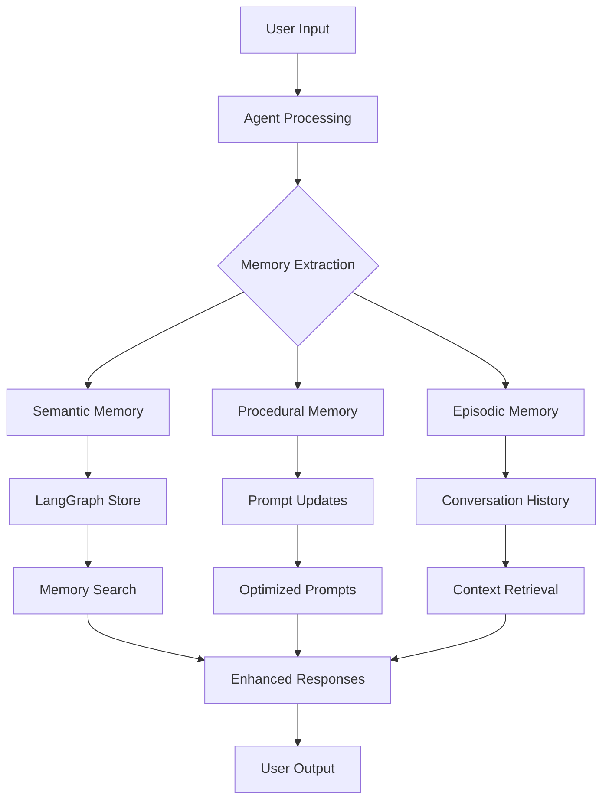

# LangMem Architecture Overview

## Core Components

```
LangMem
├── Knowledge Management
│   ├── Memory Extraction
│   │   ├── create_memory_manager()
│   │   ├── create_memory_store_manager()
│   │   └── create_thread_extractor()
│   └── Memory Tools  
│       ├── create_manage_memory_tool()
│       └── create_search_memory_tool()
│
├── Prompt Optimization
│   ├── Single Prompt
│   │   ├── Gradient Optimizer
│   │   ├── Meta-prompt Optimizer
│   │   └── Prompt Memory Optimizer
│   └── Multi Prompt
│       └── create_multi_prompt_optimizer()
│
├── Short-term Memory
│   ├── summarize_messages()
│   ├── asummarize_messages()
│   └── SummarizationNode()
│
└── LangGraph Integration
    ├── Store Integration
    ├── Background Processing
    └── ReflectionExecutor
```

## Data Flow



## Memory Types

### 1. Semantic Memory
- **Purpose**: Store facts, preferences, and knowledge
- **Examples**: "User prefers dark mode", "Lives in Istanbul"
- **Storage**: Structured Pydantic models or simple strings

### 2. Procedural Memory  
- **Purpose**: Improve how tasks are performed
- **Examples**: Email writing style, code generation patterns
- **Storage**: Optimized prompts and instructions

### 3. Episodic Memory
- **Purpose**: Remember specific conversations and events
- **Examples**: Previous discussions, user feedback
- **Storage**: Conversation summaries and key moments

## Optimization Strategies

### Gradient Optimizer
```
1. Analyze current performance
2. Identify failure modes
3. Generate improvement hypotheses
4. Apply targeted changes
```

### Meta-prompt Optimizer
```
1. Learn from examples
2. Extract success patterns
3. Apply patterns to new prompts
```

### Prompt Memory Optimizer
```
1. Single-shot optimization
2. Historical pattern recognition
3. Direct prompt updates
```

## Integration Points

### LangGraph Store
- **Persistent storage** for all memory types
- **Vector search** for semantic retrieval
- **Namespace isolation** for multi-user scenarios

### Background Processing
- **ReflectionExecutor** for async memory updates
- **Debouncing** to avoid duplicate work
- **Error handling** and retry logic

### Tools Integration
- **Memory management tools** for agents
- **Search capabilities** for context retrieval
- **Automatic memory extraction** during conversations