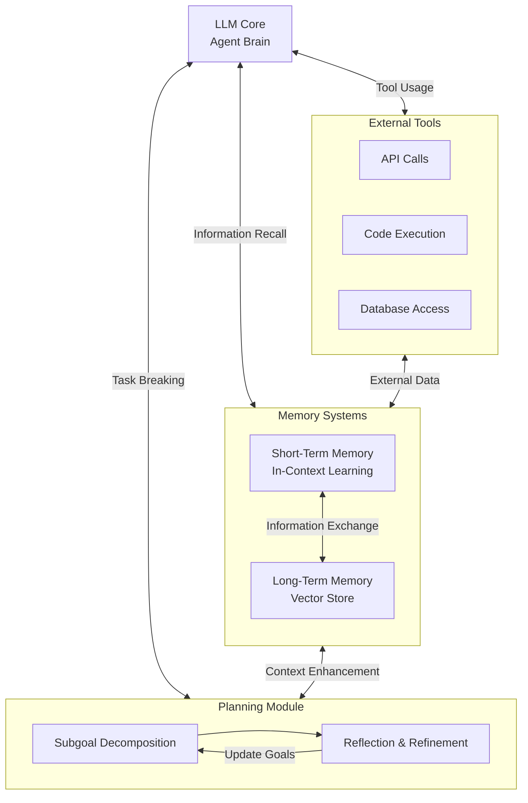

# agents_workspace

An LLM-powered autonomous agent system integrates several key components around a central LLM "brain":

1. Planning Module
   - Subgoal Decomposition:
     * Breaks complex tasks into smaller, manageable pieces
     * Creates hierarchical task structures
     * Enables parallel processing of subtasks
     * Helps manage task dependencies

   - Reflection & Refinement:
     * Analyzes past actions and their outcomes
     * Identifies successful and unsuccessful strategies
     * Updates approaches based on learned experiences
     * Implements continuous improvement loops

2. Memory Systems
   - Short-Term Memory:
     * Implements in-context learning
     * Maintains immediate task context
     * Handles recent interactions and information
     * Limited by context window size

   - Long-Term Memory:
     * Uses vector stores for persistent storage
     * Enables efficient information retrieval
     * Stores historical interactions and knowledge
     * Supports infinite information retention

3. Tool Integration
   - External API Access:
     * Retrieves real-time information
     * Accesses external services
     * Updates knowledge beyond training data
   
   - Code Execution:
     * Runs computations
     * Tests solutions
     * Validates outputs

   - Database Access:
     * Retrieves proprietary information
     * Manages structured data
     * Maintains persistent state

The system's effectiveness comes from how these components interact:
- Planning informs memory about what information to retain
- Memory provides context for better planning
- Tools augment both planning and memory capabilities
- The LLM orchestrates all components to achieve goals

## Papers
- [A Survey on Large Language Model based Autonomous Agents](https://arxiv.org/pdf/2308.11432)
- [The Rise and Potential of Large Language Model Based Agents: A Survey](https://arxiv.org/pdf/2309.07864)

## Reading and Blogs
- [LLM Powered Autonomous Agents](https://lilianweng.github.io/posts/2023-06-23-agent/)
- [LLM Agents](https://www.promptingguide.ai/research/llm-agents)
- [AI Agent with langgraph - tutorial](https://www.deeplearning.ai/short-courses/ai-agents-in-langgraph/)
- [AI Agents: A Deep Dive into LangChain’s Agent Framework](https://www.analyticsvidhya.com/blog/2024/07/langchains-agent-framework/)
- [AI Agent Workflows: A Complete Guide on Whether to Build With LangGraph or LangChain](https://towardsdatascience.com/ai-agent-workflows-a-complete-guide-on-whether-to-build-with-langgraph-or-langchain-117025509fa0)
  
## Part of the LLM Agents

### Planning
- [UnderstandingtheplanningofLLMagents:Asurvey](https://arxiv.org/pdf/2402.02716)
- [Planning for Agents](https://blog.langchain.dev/planning-for-agents/)
- [Literature Review on Task Planning with LLM Agents](https://isamu-website.medium.com/literature-review-on-task-planning-with-llm-agents-a5c60ce4f6de)

Let me break down the components of an LLM-powered autonomous agent system.

