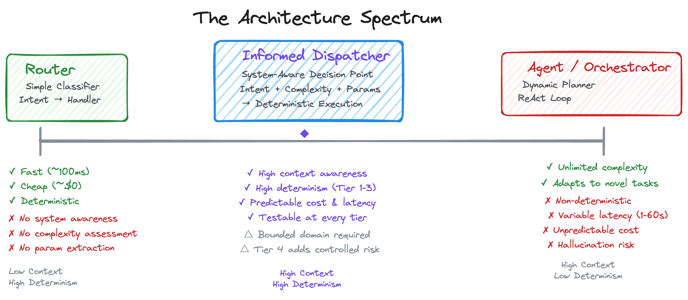
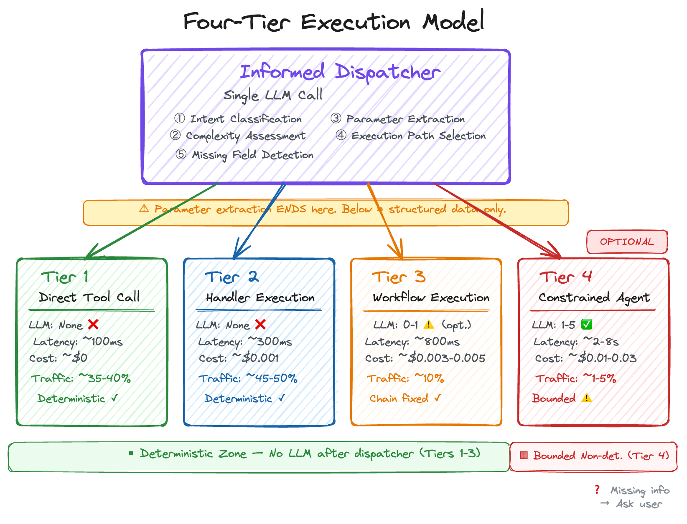
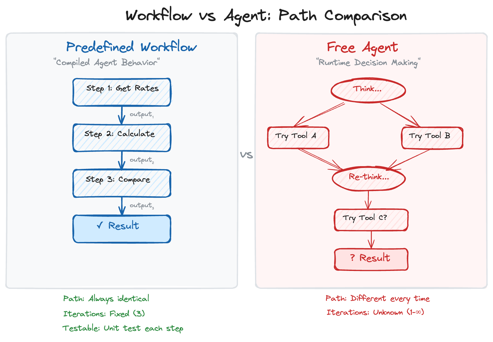
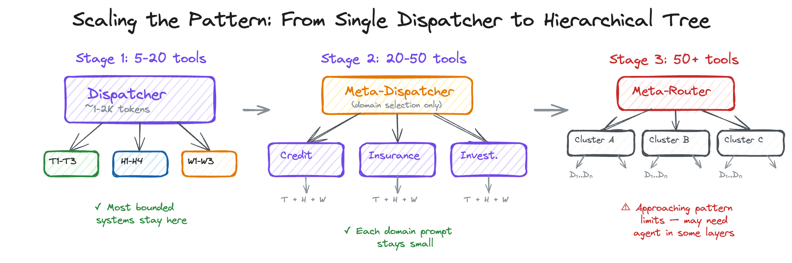
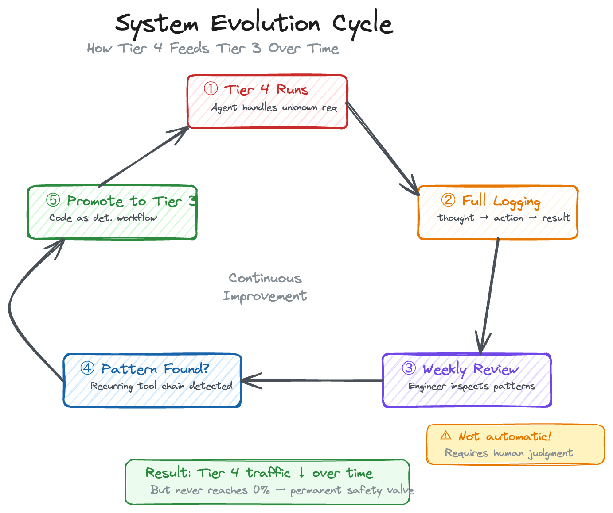

# Informed Dispatcher Pattern: Router ile Orchestrator Arasındaki Boşluğu Doldurmak

*LLM tabanlı sistemler için routing'den fazlasını, agent orchestration'dan azını sunan pratik bir mimari pattern.*

---

## Eksik Olan Orta Nokta

LLM tabanlı sistemler geliştirdiyseniz, tanıdık bir mimari gerilimle karşılaşmışsınızdır. Bir tarafta **Router** var — basit, hızlı, deterministik. Intent'i sınıflandırır, isteği yönlendirir. Diğer tarafta **Orchestrator** var — güçlü, esnek, karmaşık görevleri runtime'da dinamik alt görevlere bölebilen, birden fazla worker'ı koordine eden bir yapı.

Gerçek dünya sistemlerinin çoğu bu iki ucun hiçbirine tam oturmuyor.

Router yeterince bilgi sahibi değildir. İsteğin *nereye* gitmesi gerektiğini söyleyebilir ama *nasıl* işlenmesi gerektiğini bilemez. Orchestrator her şeyi bilir ama non-determinizm, öngörülemeyen latency, değişken maliyet ve doğruluğun kritik olduğu alanlarda kabul edilemez hallucination riski getirir.

Ya arada bir şey olsaydı? Orchestrator'ın domain farkındalığını taşıyan ama router'ın deterministik execution garantilerini koruyan bir pattern?

Buna **Informed Dispatcher** diyorum.

---

## Spectrum'u Anlamak

Pattern'in kendisine geçmeden önce, komşularına göre nerede durduğunu anlamak faydalı olacaktır.

### Router

Router bir sınıflandırma katmanıdır. Girdiyi alır, intent belirler, isteği bir handler'a yönlendirir. Hepsi bu. Handler'ın ne yaptığını, hangi tool'ların mevcut olduğunu veya görevin basit mi karmaşık mı olduğunu bilmez. Tek bir karar verir — *nereye* — ve devam eder.

```
Kullanıcı Girdisi → [Router: "Hangi intent?"] → Handler A / Handler B / Handler C
```

**Güçlü yanları:** Hızlı, ucuz, öngörülebilir. Tek LLM call (hatta bir classifier bile yeterli), sabit latency, deterministik downstream execution.

**Sınırlamaları:** Sistem yeteneklerinden habersiz. Görev zorluğunu değerlendiremez. Her istek, zorluğundan bağımsız olarak aynı muameleyi görür. Parametre çıkaramaz, eksik bilgi tespit edemez.

### Orchestrator (Agent Tabanlı)

Orchestrator — özellikle LangGraph, CrewAI veya Anthropic'in orchestrator-workers modeli gibi framework'lerde tanımlanan agent pattern'ı — dinamik bir planlayıcıdır. Girdiyi alır, hangi alt görevlerin gerektiğini düşünür, worker'lar başlatır, ara sonuçları değerlendirir ve gözlemlere göre yeniden planlayabilir. ReAct döngüsü veya benzer bir reasoning framework'ü kullanır.

```
Kullanıcı Girdisi → [Orchestrator: "Hangi alt görevler?"] → Worker 1 → Gözlem → Worker 2 → ... → Sonuç
```

**Güçlü yanları:** Sınırsız karmaşıklığı ele alabilir. Yeni isteklere uyum sağlar. Tool'ları dinamik olarak zincirleyebilir.

**Sınırlamaları:** Non-deterministic execution yolları. Değişken latency (saniyelerden dakikalara). Öngörülemeyen maliyet. Multi-step reasoning'de hallucination riski. Test etmek, debug yapmak ve SLA garantisi vermek son derece zordur.

<!-- GÖRSEL 1: diagram1_spectrum.png — Mimari Spectrum: Router → Informed Dispatcher → Agent/Orchestrator -->


### Aradaki Boşluk

Bu iki uç arasında, şunlara ihtiyaç duyan sistemlerin kapladığı önemli bir tasarım alanı var:

- Execution path seçmeden önce görev zorluğunu anlama
- Sistemdeki tool ve yeteneklerin ne olduğunu bilme
- Doğal dilden yapılandırılmış parametreler çıkarma
- Hem basit hem karmaşık istekleri verimli şekilde işleme
- Her seviyede deterministik, test edilebilir execution sürdürme

Informed Dispatcher'ın yaşadığı yer burası.

---

## Informed Dispatcher Pattern

### Tanım

> **Informed Dispatcher**, bir sistemin tüm yeteneklerinin — tool'ları, handler'ları ve önceden tanımlanmış workflow'ları — tam farkındalığına sahip olan, bu context'i kullanarak hem intent'i hem zorluğu sınıflandıran, gerekli bilgiyi (parametre, eksik alan, conversation context) çıkaran ve ardından execution'ı uygun deterministik path'e delege eden **tek LLM karar noktasıdır**. Tek bir call'da *nereye*, *nasıl* ve *hangi parametrelerle* işlenmesi gerektiğine karar verir — ama planı asla kendisi çalıştırmaz.

Temel içgörü şudur: **bir routing kararının kalitesi, router'ın yönlendirdiği hedef hakkında ne kadar bilgi sahibi olduğuyla doğru orantılıdır.**

Downstream handler'lar hakkında hiçbir şey bilmeyen bir Router, yalnızca yüzeysel intent'e göre karar verir. Sistemin tam yetenek haritasını bilen bir Informed Dispatcher ise — her tool'un ne yaptığını, her handler'ın neyi işleyebildiğini, hangi önceden tanımlanmış workflow'ların mevcut olduğunu — her istek için *en iyi* execution stratejisi hakkında sofistike kararlar verebilir.

### Temel İlke: Geniş Kapsamlı Tek Karar Noktası

Informed Dispatcher'ın gücü, ilk katmandaki kararın kapsamının genişliğinden gelir. Tek bir LLM call'da birden fazla sorumluluğu üstlenir:

**Intent Classification** — Kullanıcının ne istediğini belirler. Intent bilmeden route edemezsin.

**Complexity Assessment** — Görevin easy/medium/hard olduğunu değerlendirir. Zorluğu bilmeden doğru tier'ı seçemezsin.

**Knowledge Extraction** — Parametreleri, filtreleri, tercihleri doğal dilden çıkarır. Handler'lar structured input bekler.

**Missing Field Detection** — Hangi zorunlu bilgilerin eksik olduğunu tespit eder. Eksik bilgiyle çalıştırmak yerine sormak daha iyi.

**Execution Path Selection** — Doğru tool, handler veya workflow'u seçer. Tüm yukarıdakileri bilmeden bu karar verilemez.

Bu sorumluluklar birbirinden bağımsız değildir — iç içe geçmişlerdir. Zorluğu doğru değerlendirmek için tool'ların ne yaptığını bilmeniz gerekir. Doğru handler'ı seçmek için parametreleri çıkarmış olmanız gerekir. Eksik alanları tespit etmek için seçilen handler'ın ne beklediğini bilmeniz gerekir.

Bu yüzden hepsi tek call'da, tek karar noktasında gerçekleşir.

### Dispatcher Neden Tüm Context'i Bilmeli?

Dispatcher "bu kolay mı zor mu" kararını tool'ları bilmeden veremez. Şu örneği düşünün:

Bir kullanıcı soruyor: *"Mevcut kurulumumu alternatiflerle karşılaştır, erken çıkış maliyetlerini de dahil et."*

Naif bir Router bunu "karşılaştırma" olarak sınıflandırıp comparison handler'a gönderebilir. Ama o handler sadece alternatifleri karşılaştırır — erken çıkış maliyetlerini hesaplamaz. İstek aslında bir termination calculator'dan gelen verinin comparison engine'e beslenmesini gerektiriyor.

Informed Dispatcher şunları bilir:
- `termination_calculator` ve `comparison_engine` ayrı tool'lardır
- Birinin çıktısının diğerine girdi olması gerekir
- `comparison_with_termination` adında önceden tanımlanmış bir workflow tam olarak bu pattern'ı karşılar
- Kullanıcı henüz tüm gerekli parametreleri vermemiş

Bu bir *routing* kararıdır — ama doğru yapabilmek için derin sistem bilgisi gerektirir.

### Dispatcher'ın Bildiği Context Katmanları

Informed Dispatcher'ın system prompt'u dört tip context içerir:

**Tool Registry** — Her tool'un ne yaptığı, parametreleri, dönüş şeması. *"Tek tool yeter mi, birden fazla mı lazım?"* değerlendirmesini sağlar.

**Handler Tanımları** — Her handler ne yapar, hangi tool'ları birleştirir, hangi parametreleri bekler. *"Mevcut bir handler bunu zaten çözüyor mu?"* değerlendirmesini sağlar.

**Workflow Tanımları** — Önceden tanımlanmış multi-step execution planları ve tool zincirleri. *"Bu karmaşık istek için kanıtlanmış bir workflow var mı?"* değerlendirmesini sağlar.

**Conversation Context** — Daha önce ne konuşuldu, hangi veriler zaten alındı. *"Önceki sonuçları yeniden kullanabilir miyim?"* değerlendirmesini sağlar.

---

## Dört Katmanlı Execution Modeli

Informed Dispatcher sadece yönlendirmez — isteği *uygun seviyedeki makineye* yönlendirir. Dispatcher tek LLM call'da tüm kararları verir ve parametreleri çıkarır. Ondan sonrası: Katman 1-2'de sıfır LLM, Katman 3'te tool zinciri deterministik (opsiyonel formatlama LLM'i), Katman 4'te sınırlı agent. Tanımlanmamış senaryolar için isteğe bağlı olarak etkinleştirilebilen, sıkı kurallarla sınırlandırılmış bir agent katmanı devreye girebilir.

<!-- GÖRSEL 2: diagram2_architecture.png — Dört Katmanlı Execution Modeli -->


**Kritik kural:** Parameter extraction dispatcher'da biter. Handler'lara ve workflow'lara giden `params` tamamen structured, doğrulanmış veridir. Katman 1-2'de hiçbir LLM çağrısı yoktur — sadece deterministik kod (regex, hesaplama, sorting, filtreleme). Katman 3'te tool zinciri deterministiktir, ancak ara step'lerde opsiyonel hafif LLM kullanımı (formatlama, özetleme) olabilir.

### Katman 1 — Direct Tool Call (Basit İstekler)

Tek bir tool'a, sıfır veya minimal parametreyle eşlenen istekler için dispatcher tool'u belirler ve doğrudan çağrılır. Ek LLM inference yok. Handler mantığı yok.

**Özellikleri:**
- Tek tool, sıfır veya minimal parametre
- Hesaplama, dönüşüm veya birleştirme gerekmiyor
- Tool'un ham çıktısı (bir URL, bir liste, bir durum) cevabın kendisi

**Beklenen dağılım:** Trafiğin ~%35-40'ı.

**Maliyet:** Dispatcher call'ı dışında etkin olarak $0. **Latency:** ~100ms. **LLM:** Yok.

### Katman 2 — Handler Execution (Orta Seviye İstekler)

Filtreleme, sıralama, hesaplama veya 1-2 tool'un bilinen mantıkla birleştirilmesini gerektiren istekler için dispatcher bir handler seçer ve çıkardığı parametreleri sağlar. Handler deterministik olarak çalışır — **hiçbir LLM çağrısı yoktur**, sadece kod.

**Özellikleri:**
- Dispatcher'dan gelen structured parametrelerle çalışır (doğal dil parse etmez)
- İş mantığı içerir (sıralama, filtreleme, hesaplama, regex, formatlama)
- 1-2 tool call, deterministik birleştirme mantığı
- Her handler bağımsız, unit test edilebilir bir modül

**Beklenen dağılım:** Trafiğin ~%45-50'si.

**Maliyet:** İstek başına ~$0.001. **Latency:** ~300ms. **LLM:** Yok.

### Katman 3 — Workflow Execution (Karmaşık İstekler)

Pattern'in gücünün en belirgin hale geldiği yer burası. Geleneksel olarak bir agent'ın multi-step reasoning'ini gerektirecek karmaşık istekler, **önceden tanımlanmış, deterministik workflow'lar** tarafından karşılanır — benim *derlenmiş agent davranışı (compiled agent behavior)* dediğim şey.

Bir workflow aslında şu sorunun cevabıdır: *"Bu isteği bir agent kusursuz şekilde işleseydi, hangi tool zincirini çalıştırırdı?"* Bu zinciri kodda tanımlarsınız, step'ler arasındaki veri akışını açıkça belirlersiniz. Dispatcher'ın görevi sadece doğru workflow'u seçmek ve başlangıç parametrelerini sağlamaktır.

**Özellikleri:**
- 2-4 tool call, tanımlı bir sırayla — **tool zinciri her zaman aynı**
- N. step'in çıktısı N+1. step'e beslenir (açık veri akışı)
- Sabit iterasyon sayısı (döngü yok, yeniden planlama yok)
- Tüm zincir tek, test edilebilir bir birim
- **Opsiyonel:** Ara step'lerde hafif LLM kullanımı (formatlama, özetleme) olabilir — ama bu step'ler de önceden tanımlıdır, runtime kararı değildir

**Beklenen dağılım:** Trafiğin ~%10'u.

**Maliyet:** İstek başına ~$0.003 (LLM step yoksa) / ~$0.005 (LLM step varsa). **Latency:** ~800ms (deterministik, öngörülebilir).

### Katman 4 — Constrained Agent (Opsiyonel Çıkış Kapısı)

Burası pattern'in en tartışmalı ama en pragmatik katmanı. İlk üç katman tamamen deterministiktir — önceden tanımlanmış path'ler, sabit tool zincirleri, test edilebilir çıktılar. Ama gerçek dünyada, tanımlanmamış senaryolar kaçınılmazdır. Bir kullanıcı, hiçbir handler'ın veya workflow'un kapsamına girmeyen bir istek yapabilir. Katman 4, bu durumlar için **sıkı kurallarla sınırlandırılmış, policy ile yönetilen bir free agent** katmanıdır.

Önemli olan şudur: bu katman **varsayılan olarak kapalıdır**. Açılması, sistem yöneticisinin bilinçli bir policy kararıdır.

**Birincil Amaç: Kontrollü Çıkış Kapısı**

Katman 4'ün varlık sebebi basittir: **Katman 1-3 kapsamına girmeyen isteklere "üzgünüm, bunu yapamıyorum" demek yerine, kontrollü bir deneme şansı vermek.** Katman 3'ün sınırı, önceden tanımlanmış workflow'ların kapsamıdır. Bir istek hiçbir workflow'a uymadığında, medium fallback devreye girer — ama bu genellikle eksik bir cevap üretir. Katman 4, "tanımlanmamış ama meşru" istekler için bir güvenlik valfidir.

Katman 4 kalıcıdır. Trafik payı zamanla azalsa da hiçbir zaman sıfırlanmaz — çünkü sınırlı bir domain'de bile her zaman öngörülmemiş istekler olacaktır. Bu bir geçiş katmanı değil, **kalıcı bir güvenlik valfidir.**

Agent'ın tüm risklerini almaz çünkü sıkı kısıtlamalarla çalışır:

**Kısıtlamalar (Guardrails):**

- **Max iteration: 3-5** — Sonsuz döngü riski ortadan kalkar.
- **Tool whitelist: Sadece mevcut MCP tool'lar** — Agent'ın tanımsız tool çağırması engellenir.
- **Hard timeout: 8-10 saniye** — SLA garanti edilir.
- **Token budget: Max ~2K output token** — Maliyet patlaması önlenir.
- **Sonuç doğrulama: Tool çıktısı vs agent yanıtı karşılaştırması** — Hallucination tespiti.
- **Tam loglama: Her thought-action-observation kaydedilir** — Audit trail + workflow keşfi.

**Policy ile Yönetim:**

Katman 4'ün en kritik özelliği, **açılıp kapatılabilir** olmasıdır. Bu bir code change değil, bir konfigürasyon kararıdır:

```python
class AgentPolicy:
    enabled: bool = False              # Varsayılan: kapalı
    allowed_tools: list[str] = []       # Boş = hiçbir tool kullanılamaz
    max_iterations: int = 3
    timeout_seconds: float = 8.0
    max_output_tokens: int = 2000
    require_approval: bool = False      # True = insan onayı gerekir
    allowed_hours: tuple = (9, 18)      # Sadece mesai saatlerinde
    daily_budget: float = 5.0           # Günlük max harcama ($)
    log_level: str = "verbose"          # Her adım loglanır
```

Bu policy ortam bazında farklılık gösterebilir:

- **Development:** `enabled=True, max_iterations=5` — Tam keşif modu
- **Staging:** `enabled=True, require_approval=True` — Test ama onaylı
- **Production:** `enabled=False` — Kapalı (ilk aşama)
- **Production (olgun):** `enabled=True, max_iterations=3, daily_budget=5.0` — Sınırlı açık

**Beklenen dağılım:** Trafiğin ~%1-3'ü (yalnızca Katman 3'ün karşılayamadığı istekler).

**Maliyet:** İstek başına ~$0.01-0.03. **Latency:** ~2-8s (değişken ama bounded).

**İkincil Fayda: Workflow Keşif Potansiyeli**

Katman 4'ün birincil amacı kontrollü çıkış kapısı olmaktır. Ancak her çalışması tam olarak loglandığı için, ikincil bir fayda olarak workflow keşfine katkı sağlayabilir.

Bununla birlikte, bu faydanın sınırlarını bilmek önemlidir: **%1-3 trafik hacminde otomatik pattern keşfi istatistiksel olarak verimsizdir.** 10.000 günlük istekte Katman 4'e düşen 100-300 istek, anlamlı pattern tespiti için yeterli veri üretmeyebilir. Bu nedenle workflow keşfi, Katman 4'ü açma gerekçesi değildir — güzel bir yan etkidir.

Keşif değerini artırmak istiyorsanız, **shadow mode** kullanabilirsiniz: Katman 4'ü daha yüksek trafikle (%10-20) çalıştırın ama sadece logla, kullanıcıya yanıt üretme. Bu, aktif servisi etkilemeden keşif verisi toplar:

```python
class AgentPolicy:
    mode: Literal["off", "shadow", "active"] = "off"
    # off:    Tamamen kapalı
    # shadow: Yüksek trafikle çalış, logla, yanıt üretme (keşif için)
    # active: Normal kullanım, tanımlanmamış isteklere yanıt üret
```

Shadow mode'da toplanan loglar, haftalık manuel incelemeyle değerlendirilir. Tekrarlayan tool zincirleri tespit edilirse, mühendis onayıyla Katman 3 workflow'una dönüştürülebilir. Ama bu süreç otomatik değildir — **insan yargısı gerektirir**, çünkü agent'ın bulduğu zincir her zaman optimal veya doğru olmayabilir.

### Dört Katmanın Karşılaştırması

**Katman 1 — Direct Tool Call:** Direkt tool call, 1 tool, LLM yok. Tam determinizm, kolay test edilebilirlik, hallucination riski yok. Policy gerekmez. Trafik payı: ~%35-40.

**Katman 2 — Handler Execution:** Handler (deterministik), 1-2 tool, LLM yok. Tam determinizm, kolay test edilebilirlik, hallucination riski yok. Policy gerekmez. Trafik payı: ~%45-50.

**Katman 3 — Workflow Execution:** Workflow (deterministik zincir), 2-4 tool, 0-1 opsiyonel LLM (formatlama). Zincir sabit, kolay test edilebilirlik, hallucination riski yok (opsiyonel LLM step'te minimal). Policy gerekmez. Trafik payı: ~%10.

**Katman 4 — Constrained Agent:** Agent (sınırlı non-det.), N tool (whitelist dahilinde), 1-5 LLM call (iteration'a bağlı). Sınırlı determinizm (bounded), test zor ama loglanır, hallucination riski düşük (guardrail'ler). **Policy gerekli.** Trafik payı: ~%1-5.

### Workflow vs. Agent vs. Constrained Agent: Kritik Ayrım

Bu, pattern'in kalbidir. Üç execution stratejisinin karşılaştırması:

**Tool sırası:**
Free Agent → Runtime'da karar verilir (non-deterministic). Workflow → Kodda tanımlı (deterministic). Constrained Agent → Runtime'da karar verilir ama whitelist dahilinde.

**Parametre akışı:**
Free Agent → Agent context'ten çıkarır (hata riski). Workflow → Açıkça kodlanmış (`step_1.output → step_2.input`). Constrained Agent → Agent çıkarır ama sınırlı adımda.

**Maksimum iterasyon:**
Free Agent → Sınırsız. Workflow → Sabit (workflow'daki step sayısı). Constrained Agent → Sabit üst sınır (3-5).

**Hallucination riski:**
Free Agent → Yüksek. Workflow → Yok, tool çıktıları doğrudan kullanılır. Constrained Agent → Düşük, guardrail + doğrulama.

**Test edilebilirlik:**
Free Agent → Son derece zor. Workflow → Standart unit testing. Constrained Agent → Zor ama tam loglama ile audit edilebilir.

**Yeni yetenek ekleme:**
Free Agent → Prompt'u güncelle ve umut et. Workflow → Yeni workflow class'ı yaz. Constrained Agent → Otomatik, tool whitelist'te ise kullanır.

**Maliyet öngörülebilirliği:**
Free Agent → Değişken (agent döngüye girebilir). Workflow → Sabit (bilinen step sayısı). Constrained Agent → Bounded (max iteration + timeout + budget).

**Yönetim:**
Free Agent → Prompt engineering. Workflow → Kod. Constrained Agent → **Policy (açılıp kapatılabilir)**.

<!-- GÖRSEL 3: diagram3_workflow_vs_agent.png — Workflow vs. Agent Karşılaştırması -->


Şöyle düşünün: **Workflow, önceden derlenmiş bir agent trace'idir.** Bir istek sınıfı için mükemmel bir agent'ın *ne yapacağını* gözlemlersiniz, ardından bu davranışı deterministik bir pipeline olarak kodlarsınız. Agent'ın zekası tasarım zamanında yakalanır, çalışma zamanında değil.

**Constrained Agent ise henüz derlenmemiş senaryolar için kalıcı bir güvenlik valfidir.** Deterministik katmanların karşılayamadığı isteklere kontrollü bir çıkış kapısı sunar. Her çalışması loglanır ve bu loglar zaman içinde yeni workflow adaylarına dönüşebilir — ama bu ikincil bir fayda, birincil amaç değildir.

---

## Dispatcher Çıktı Formatı

Informed Dispatcher, tek bir LLM call'da tek bir yapılandırılmış JSON çıktı üretir. `complexity` alanı hangi execution tier'ın isteği işleyeceğini belirler:

**Katman 1 — Direct Tool Call:**
```json
{
  "complexity": "easy",
  "tool": "status_checker",
  "params": {},
  "handler": null,
  "workflow": null
}
```

**Katman 2 — Handler:**
```json
{
  "complexity": "medium",
  "tool": null,
  "params": { "amount": 50000, "max_monthly": 2000, "term_preference": "shortest" },
  "handler": "BUDGET_CALCULATOR",
  "workflow": null
}
```

**Katman 3 — Workflow:**
```json
{
  "complexity": "hard",
  "tool": null,
  "params": { "current_rate": 3.5, "target_amount": 100000, "early_exit_month": 6 },
  "handler": null,
  "workflow": "comparison_with_early_termination",
  "agent": null
}
```

**Katman 4 — Constrained Agent (policy izin veriyorsa):**
```json
{
  "complexity": "unknown",
  "tool": null,
  "params": { "user_intent": "compare with tax implications and insurance cost" },
  "handler": null,
  "workflow": null,
  "agent": {
    "goal": "Kullanıcının çoklu domain isteğini karşıla",
    "suggested_tools": ["loan_rates", "tax_calculator", "insurance_rates"],
    "max_iterations": 3
  }
}
```

Dikkat edin: complexity alanı `"unknown"` — dispatcher bu isteğin mevcut handler/workflow kapsamına girmediğini açıkça belirtiyor. Eğer agent policy kapalıysa, dispatcher bu isteği medium fallback'e düşürür ve kullanıcıya kapsamlı bir cevap veremeyeceğini belirtir.

**Eksik Bilgi — Çalıştırmadan Önce Sor:**
```json
{
  "complexity": "medium",
  "handler": "BUDGET_CALCULATOR",
  "params": { "max_monthly": 2000 },
  "missing_required": ["amount"],
  "question": "Toplam tutar ne kadar olsun?"
}
```

Bu son durum önemlidir: dispatcher eksik parametreleri tespit edebilir *çünkü her handler ve workflow'un ne beklediğini bilir*. Değerleri tahmin etmek veya halüsine etmek yerine açıkça sorar.

### Runtime Parametre Doğrulaması

Dispatcher structured JSON üretir, handler'lar typed params bekler. Ama LLM'in çıkardığı parametrelerin handler'ın gerçekten beklediğiyle birebir eşleşeceğinin garantisi yoktur — özellikle prompt güncellendiğinde ama handler kodu güncellenmediğinde (veya tersi). Bu nedenle dispatcher çıktısı ile handler çalıştırması arasına **hafif bir validation katmanı** eklenmesi önerilir:

```python
def execute_with_validation(dispatcher_output: DispatcherResult) -> Result:
    handler = registry.get(dispatcher_output.handler)
    
    # Dispatcher'ın çıkardığı params, handler'ın beklediğiyle eşleşiyor mu?
    validation = handler.validate_params(dispatcher_output.params)
    
    if validation.is_valid:
        return handler.execute(validation.validated_params)
    
    if validation.has_missing_required:
        # Eksik zorunlu alan var — kullanıcıya sor
        return ask_user(validation.missing_fields)
    
    # Beklenmeyen parametre hatası — fallback
    log_misrouting(dispatcher_output, validation.errors)
    return default_handler.execute(dispatcher_output.params)
```

Bu validation, LLM hatalarına karşı ucuz bir güvenlik ağıdır. Ek latency etkisi ihmal edilebilir (<5ms) ama prompt-kod senkronizasyon hatalarını production'a ulaşmadan yakalar. Auto-generated registry kullanılsa bile, runtime'da doğrulama yapmak savunma derinliği (defense in depth) sağlar.

---

## Fallback Stratejisi

Hiçbir routing sistemi mükemmel değildir. Informed Dispatcher muhafazakar bir fallback stratejisi kullanır — emin olmadığında, başarısız olmak yerine üst katmana yükselt:

```
Easy (belirsiz) → Medium'a fallback
Medium (belirsiz) → varsayılan Medium handler'a fallback
Hard (eşleşen workflow yok) + Agent policy AÇIK → Katman 4 (constrained agent)
Hard (eşleşen workflow yok) + Agent policy KAPALI → Medium fallback
Katman 4 başarısız / timeout → Medium fallback + log
Dispatcher hatası → varsayılan handler'a fallback
```

Katman 4'ün fallback zincirindeki yeri policy'ye bağlıdır. Policy kapalıysa, sistem tamamen deterministik kalır — Katman 4 hiç devreye girmez. Policy açıksa, eşleşmeyen hard sorgular agent'a yönlendirilir ama agent da başarısız olursa medium'a düşer.

### Circuit Breaker: Latency Stacking'i Önlemek

Fallback zincirinin en büyük riski **latency yığılmasıdır** (latency stacking). Worst case senaryoyu düşünün: Dispatcher (~500ms) → Katman 4 timeout (8s) → Medium fallback (~300ms) = **~9 saniye** — ve kullanıcı sonunda sadece medium seviyesinde bir cevap alır.

Bu riski ortadan kaldırmak için **circuit breaker** mekanizması zorunludur:

```python
class AgentCircuitBreaker:
    # Hızlı kesme: Agent 3 saniyede ilk tool call'ı yapmadıysa kes
    first_action_timeout: float = 3.0
    
    # Toplam timeout: Policy'deki hard timeout (8s) zaten var,
    # ama circuit breaker daha erken müdahale eder
    
    # Otomatik devre dışı bırakma:
    # Son 1 saatte başarı oranı %50'nin altına düşerse
    # Katman 4'ü otomatik kapat, alert gönder
    auto_disable_threshold: float = 0.50
    auto_disable_window_minutes: int = 60
    
    # Kademeli geri açma:
    # Disable sonrası 10 dakika bekle, sonra %10 trafikle dene
    recovery_delay_minutes: int = 10
    recovery_traffic_percent: float = 0.10
```

**Pratik kurallar:**

- **Agent 3s içinde ilk action yok** → Hemen kes, Medium fallback. Max 3.5s.
- **Agent çalışıyor ama 8s timeout** → Kes, Medium fallback. Max 8.5s.
- **Son 1 saatte başarı <%50** → Katman 4 otomatik kapalı. 0s (direkt medium'a düşer).
- **Agent başarılı** → Normal akış. 2-5s.

Circuit breaker olmadan Katman 4 açmayın. Bu bir güvenlik mekanizması değil, **ön koşuldur.**

İlke: **gereğinden fazla işlenmiş bir istek, yanlış olandan her zaman iyidir.** "Easy" olarak sınıflandırılmış bir istek aslında handler mantığı gerektiriyorsa, medium katman bunu zarif şekilde yakalar. En kötü durum gereksiz hesaplama, asla yanlış sonuç değil.

---

## Ne Zaman Kullanılmalı

### Güçlü Uyum

Informed Dispatcher şu durumlarda parlıyor:

**Tool sayısı sınırlı.** 5-20 arası bilinen tool setiniz var, sınırsız bir plugin ekosistemi değil.

**İstek pattern'ları keşfedilebilir.** Log analizi ile en yaygın karmaşık istek tiplerini tespit edip bunlar için önceden workflow oluşturabilirsiniz.

**Doğruluk tartışmasız.** Finans, sağlık, hukuk — halüsine edilmiş ara reasoning'in kabul edilemez olduğu alanlar.

**SLA önemli.** "Genelde hızlı ama bazen 30 saniye" değil, öngörülebilir latency ve maliyet gerekiyor.

**Test edilebilirlik zorunlu.** Unit test yazmanız, regresyon suite'leri çalıştırmanız ve hataları güvenilir şekilde reproduce etmeniz gerekiyor.

**Kademeli benimseme tercih ediliyor.** Basit başlayıp karmaşıklığı yalnızca veri kanıtladığında eklemek istiyorsunuz.

### Zayıf Uyum

Tam orchestrator/agent şu durumlarda düşünülmeli:

**Görevler temelden öngörülemez.** Bilinmeyen sayıda dosyayı değiştiren coding agent'lar, atıf zincirlerini takip eden research agent'lar — bunlar dinamik planlama gerektirir.

**Tool kombinasyonları sınırsız.** Yaygın workflow'ları numaralandıramıyorsanız, önceden derleyemezsiniz.

**Latency ve maliyet toleransı yüksek.** 10 saniyelik yanıt sürelerinin kabul edilebilir olduğu dahili araçlar.

**Yaklaşık cevaplar yeterli.** Yaratıcı görevler, beyin fırtınası, keşifsel analiz.

---

## Uygulama Rehberi

### Faz 1: Temel (Hafta 1-2)

Yalnızca Katman 1 ve tek bir Katman 2 handler ile başlayın.

1. **Dispatcher prompt'unu** tool registry ve bir handler tanımıyla oluşturun
2. **JSON çıktı parser'ını** validation ile birlikte implemente edin
3. **Katman 1'i** bağlayın (basit istekler için direct tool call)
4. **En yaygın handler'ınızı** yeni mimariye taşıyın
5. **Monitoring ekleyin:** her dispatcher kararını logla, doğruluğu izle

### Faz 2: Handler Genişletme (Hafta 3-4)

Kalan Katman 2 handler'larını teker teker ekleyin.

1. İstek log analizinden **handler ihtiyaçlarını belirleyin**
2. Her handler'ı **bağımsız, unit test edilmiş bir modül** olarak geliştirin
3. **Dispatcher prompt'unu** yeni handler tanımlarıyla güncelleyin
4. Önceki mimariye karşı **A/B test** yapın

### Faz 3: Workflow'lar (Hafta 5-6)

Yalnızca verinizin gerekli olduğunu kanıtladığı workflow'ları ekleyin.

1. Katman 2'nin karşılayamadığı multi-step istek pattern'ları için **logları analiz edin**
2. **Workflow şemalarını** tasarlayın (tool zinciri, veri akışı, parametreler)
3. **Workflow executor'ı** implemente edin — basit bir sıralı çalıştırıcı
4. En yaygın karmaşık pattern'lar için **2-3 workflow** ekleyin
5. **İzleyin ve iterasyon yapın**

### Faz 4: Constrained Agent (Hafta 7-8, Opsiyonel)

Yalnızca Katman 1-3 yeterli veri topladıktan ve karşılanamayan istek pattern'ları netleştikten sonra:

1. **Agent policy framework'ünü** implemente edin (enabled flag, tool whitelist, budget, timeout)
2. **Development ortamında** Katman 4'ü açın, logları inceleyin
3. **Guardrail'leri** test edin — max iteration, timeout, budget limit
4. **Staging'de** `require_approval=true` ile test edin
5. **Production'da** düşük limitlerle açın (`daily_budget=5.0, max_iterations=3`)
6. **Workflow keşif pipeline'ını** kurun — agent loglarından tekrarlayan pattern tespiti

### Faz 5: Optimizasyon (Sürekli)

- Log analiziyle yönlendirilen yeni workflow'lar ekleyin (asla spekülasyonla değil)
- Katman 4 loglarından workflow adaylarını tespit edip Katman 3'e taşıyın
- Yanlış sınıflandırma verisine göre dispatcher prompt'unu ayarlayın
- Handler/workflow performansını optimize edin
- Tekrarlayan dispatcher kararları için caching düşünün
- Katman 4 trafik payını izleyin — düşüyorsa sistem olgunlaşıyor, artıyorsa sınırlarına yaklaşıyor

Temel felsefe: **veri odaklı, kademeli benimseme.** Production loglarında pattern'ı görmeden asla workflow oluşturmayın. Basitliğin yetersiz kaldığı kanıtlanmadan asla karmaşıklık eklemeyin.

---

## Pattern'i Ölçeklendirmek

Informed Dispatcher'ın en sık karşılaşılan eleştirisi şudur: *"Dispatcher her şeyi bilmeli diyorsun ama 50 tool, 30 workflow olduğunda system prompt ne olacak?"*

Bu haklı bir eleştiri — ve cevabı basit: **pattern'in kendisi de katmanlı olarak ölçeklenir.**

### Ölçek Aşamaları

<!-- GÖRSEL 5: diagram5_scaling.png — Ölçek Aşamaları -->


**Aşama 1 — Tek Dispatcher (5-20 tool):** Pattern'in temel hali. Tool registry, handler tanımları ve workflow tanımları tek system prompt'a sığar (~1-2K token). Çoğu bounded domain sistemi bu aşamada kalır ve kalmalıdır.

**Aşama 2 — Domain Dispatcher'lar (20-50 tool):** Sistem birden fazla domain'e yayıldığında, üst seviyede hafif bir **Meta-Dispatcher** eklenir. Bu dispatcher sadece domain seçer (kredi, sigorta, yatırım) — her domain kendi Informed Dispatcher'ına sahiptir. Meta-Dispatcher'ın prompt'u küçük kalır çünkü sadece domain tanımlarını içerir, tool detaylarını değil.

**Aşama 3 — Hiyerarşik Ağaç (50+ tool):** Bu noktada pattern'in sınırlarına yaklaşıyorsunuz. Domain cluster'ları altında alt-dispatcher'lar çalışır. Ama dürüst olmak gerekirse, 50+ tool'a ulaşan bir sistemin muhtemelen bazı katmanlarında agent davranışına ihtiyacı vardır.

### Prompt Yönetimi: Auto-Generated Registry

Ölçeklendirmenin en pratik çözümü, dispatcher prompt'unu **koddan otomatik üretmektir**. Her handler ve workflow class'ına metadata eklersiniz, build time'da prompt otomatik oluşur:

```python
class BudgetHandler(BaseHandler):
    """Aylık bütçeye göre uygun seçenekleri hesaplar."""
    
    complexity = "medium"
    required_params = ["amount", "max_monthly_payment"]
    optional_params = ["term_preference"]
    tools_used = ["loan_rates"]

# Build time'da tüm handler'lardan prompt otomatik generate edilir
registry = ToolRegistry.from_handlers([BudgetHandler, RateFilterHandler, ...])
dispatcher_prompt = registry.to_prompt()  # Compact format, ~1-2K token
```

Bu yaklaşımın iki kritik faydası vardır. Birincisi, kod ve prompt her zaman senkron kalır — yeni handler eklediğinizde prompt otomatik güncellenir. İkincisi, prompt formatı optimize edilebilir — verbose açıklamalar yerine compact schema kullanılır.

### Token Bütçesi Yönetimi

Dispatcher prompt'u için somut hedefler:

- **Tool Registry (~300-500 token):** Compact format — isim, tek satır açıklama, parametre listesi.
- **Handler Tanımları (~300-500 token):** İsim, kullandığı tool'lar, beklediği parametreler.
- **Workflow Tanımları (~200-400 token):** İsim, step listesi, ne zaman kullanılacağı.
- **Routing Kuralları (~200-300 token):** Öncelik sırası, fallback kuralları.
- **Toplam: ~1-2K token** — Context window'un %1-2'si.

Eğer toplam 3K token'ı geçiyorsa, bu genellikle tanımların çok verbose olduğunun veya domain'in bölünmesi gerektiğinin işaretidir.

---

## Agent'a Ne Zaman Geçilmeli?

Informed Dispatcher bir son nokta değildir — bir **başlangıç noktasıdır**. Her pattern'in geçerlilik sınırları vardır ve bu sınırları bilmek, pattern'i bilmek kadar önemlidir.

### Kırmızı Bayraklar

Şu sinyalleri gördüğünüzde pattern'in sınırlarına yaklaştığınızı bilin:

**1. Workflow patlaması.** Workflow sayısı 15-20'yi geçtiğinde ve hâlâ yeni pattern'lar keşfediyorsanız, domain'iniz sandığınızdan daha dinamik demektir. Bu noktada her yeni edge case için workflow yazmak bakım kabusu haline gelir.

**2. Yüksek fallback oranı.** Dispatcher kararlarını izlediğinizde, isteklerin %15'inden fazlası fallback'e düşüyorsa, bu dispatcher'ın mevcut handler/workflow kapsamıyla istekleri karşılayamadığının göstergesidir.

**3. Cross-domain zincirler.** Kullanıcılar giderek daha fazla birden fazla domain'i birleştiren istekler yapıyorsa — örneğin "kredi hesapla + vergi etkisini göster + sigorta maliyetini ekle" — önceden tanımlanmış workflow'lar bu kombinasyonları karşılayamaz.

**4. Workflow'ların ömrü kısalıyorsa.** Oluşturduğunuz workflow'lar birkaç hafta içinde güncellenmesi veya değiştirilmesi gerekiyorsa, domain'inizdeki değişim hızı pre-compilation yaklaşımıyla uyumsuz demektir.

### Somut Eşik Değerler

Deneyime dayalı geçiş kriterleri:

- **Workflow sayısı:** Güvenli ≤10 | Uyarı 10-20 | Geçiş düşünülmeli >20
- **Fallback oranı:** Güvenli ≤%5 | Uyarı %5-15 | Geçiş düşünülmeli >%15
- **Misrouting oranı:** Güvenli ≤%3 | Uyarı %3-10 | Geçiş düşünülmeli >%10
- **Edge case oranı:** Güvenli ≤%5 | Uyarı %5-10 | Geçiş düşünülmeli >%10
- **Workflow ortalama ömrü:** Güvenli >3 ay | Uyarı 1-3 ay | Geçiş düşünülmeli <1 ay

Bu rakamlar kesin kurallar değil, yönlendirici göstergelerdir. Önemli olan production metriklerinizi sürekli izleyip trend analizi yapmanızdır.

### Geçiş Tam Olmak Zorunda Değil

Agent'a geçiş "ya hep ya hiç" kararı değildir. Katman 4 zaten bu geçişin ilk adımını pattern'in içine yerleştirmiştir. Pattern'in doğal evrimi kademeli bir hibridleşmedir:

**Adım 1 — Katman 4'ü Açın (Policy: Development):** Geliştirme ortamında Katman 4'ü etkinleştirin. Agent loglarını toplayın. Hangi tool zincirlerinin tekrarlandığını gözlemleyin.

**Adım 2 — Katman 4'ü Production'a Taşıyın (Policy: Sınırlı):** Önce circuit breaker'ı devreye alın (bkz. Fallback Stratejisi). Ardından `max_iterations=3, daily_budget=5.0, require_approval=false` ile production'da açın. Trafiğin sadece %1-3'ü bu katmana düşecektir.

**Adım 3 — Log Analizi ve Manuel Workflow Keşfi:** Katman 4 loglarını haftalık olarak inceleyin. Tekrarlayan tool zinciri pattern'ları tespit ederseniz, mühendis onayıyla Katman 3 workflow'una dönüştürün. Bu süreç otomatik değildir — insan yargısı gerektirir. %1-3 trafik hacminde anlamlı pattern tespiti zaman alır; sabırlı olun.

**Adım 4 — Eşik Aşımı:** Eğer Katman 4'e düşen trafik %5'i aşıyorsa ve workflow'a dönüştürülemeyen çeşitlilik artıyorsa, bu pattern'in sınırlarına ulaştığınızın göstergesidir. Bu noktada iki seçenek vardır:

- **Domain bölme:** Sistemi birden fazla Informed Dispatcher'a ayırın (her biri kendi bounded domain'i)
- **Hibrit mimari:** Katman 1-3 Informed Dispatcher olarak kalır (trafiğin %80-90'ı), Katman 4 daha geniş yetkilerle çalışır. Ama bu artık Informed Dispatcher pattern'i değil, hibrit bir mimaridir — ve bu geçişi bilinçli olarak yapmalısınız.

Bu kademeli geçiş, pattern'in en güçlü avantajını korur: **trafiğin büyük çoğunluğu her zaman deterministik kalır.**

---

## İzleme ve Evrim

Informed Dispatcher'ın başarısı, dispatcher'ın karar kalitesiyle doğrudan orantılıdır. Bu kaliteyi ölçmeden iyileştirmek mümkün değildir.

### Temel Metrikler

Her dispatcher kararı için şu verileri loglayın:

**1. Predicted vs Actual Complexity:**
```
Log kaydı: {
  "query": "...",
  "predicted_complexity": "easy",
  "predicted_handler": "credit_score_url",
  "actual_execution": "easy",        // Gerçekte ne oldu?
  "fallback_triggered": false,        // Fallback'e düştü mü?
  "execution_success": true,          // Sonuç başarılı mı?
  "latency_ms": 145,
  "user_satisfaction": null            // Opsiyonel: thumbs up/down
}
```

**2. Misrouting Tespiti:** Dispatcher "easy" dedi ama handler hata verdi → yanlış sınıflandırma. Dispatcher "medium" dedi ama kullanıcı eksik bilgi aldı → yetersiz katman seçimi. Bu vakaları otomatik tespit edip haftalık rapor oluşturun.

**3. Workflow Coverage:** Gelen isteklerin yüzde kaçı mevcut handler/workflow'larla karşılanıyor? Bu oran düşüyorsa, yeni handler/workflow eklenmeli veya pattern sınırlarına yaklaşılıyor demektir.

### Dashboard Metrikleri

**Doğruluk ve Routing:**
- **Doğru katman seçim oranı:** Hedef >%95, uyarı <%90 → Dispatcher prompt review
- **Fallback oranı:** Hedef <%5, uyarı >%10 → Yeni handler/workflow ekle
- **Workflow coverage:** Hedef >%90, uyarı <%80 → Log analizi, yeni workflow
- **Misrouting oranı:** Hedef <%3, uyarı >%5 → Routing kuralları güncelle

**Latency:**
- **Easy:** Hedef <200ms, uyarı >500ms → Tool performance check
- **Medium:** Hedef <600ms, uyarı >1s → Handler optimization
- **Hard:** Hedef <1.5s, uyarı >3s → Workflow step analizi

**Katman 4:**
- **Trafik payı:** Hedef <%3, uyarı >%5 → Agent log, workflow dönüşümü
- **Başarı oranı:** Hedef >%80, uyarı <%60 → Guardrail/prompt review
- **Günlük harcama:** Hedef <$5, uyarı >$10 → Policy budget'ı sık

### Evrim Döngüsü

Pattern durağan değildir — sürekli evrilen bir döngüde çalışır:

<!-- GÖRSEL 4: diagram4_evolution.png — Evrim Döngüsü -->


**Haftalık:** Misrouting ve fallback oranlarını kontrol edin. Ani spike'lar genellikle yeni bir kullanıcı pattern'ının ortaya çıktığını gösterir.

**Aylık:** Workflow coverage analizi yapın. Mevcut workflow'larla karşılanamayan en sık 5 istek tipini belirleyin. Bunların sıklığı handler/workflow eklemeyi haklı kılıyorsa ekleyin, kılmıyorsa fallback'in devam etmesine izin verin.

**Çeyreklik:** Genel pattern sağlığını değerlendirin. Eşik değerleri gözden geçirin. Agent'a geçiş sinyallerini kontrol edin. Dispatcher prompt'unun token bütçesini ölçün.

### Bakım Yükünü Minimize Etmek

Pattern'e yöneltilen haklı eleştirilerden biri, "her yeni tool eklediğinde hem kodu hem prompt'u güncellemelisin" şeklindedir. Bu gerçek bir trade-off'tur — ama doğru perspektifle bakılmalıdır.

Agent tabanlı bir sistemde de yeni tool eklediğinizde tool description yazarsınız ve agent'ın bunu doğru kullanacağını *umarsınız*. Informed Dispatcher'da ise tool description + handler/workflow yazarsınız ve nasıl kullanılacağını *garanti edersiniz*. Bakım maliyeti benzerdir, güvence seviyesi çok farklıdır.

Bununla birlikte, bakım yükünü azaltmak için somut adımlar atılabilir:

**Auto-generated registry:** Daha önce bahsedildiği gibi, handler/workflow metadata'sından dispatcher prompt'u otomatik üretin. Kod ve prompt arasındaki senkronizasyon hatası sıfıra iner.

**Integration test suite:** Her handler ve workflow için "dispatcher bu sorguyu bana yönlendirmeli" şeklinde test case'ler yazın. Yeni bir bileşen eklendiğinde, mevcut testlerin kırılıp kırılmadığı otomatik kontrol edilir.

**Prompt diff monitoring:** Dispatcher prompt'undaki her değişikliği versiyon kontrolüne alın. Değişiklik sonrası bir regression suite çalıştırın — "bu 100 test sorgusundan kaçı farklı route'a gidiyor?"

---

## Maliyet ve Performans Karşılaştırması

Günde 10.000 istek işleyen bir sistem için tipik dağılımla (%35 easy, %55 medium, %8 hard/workflow, %2 unknown/agent):

**Maliyet (istek başına):**
- Easy → Basit Router: ~$0.001 (gereksiz LLM) | **Informed Dispatcher: ~$0** (LLM bypass) | Full Agent: ~$0.005
- Medium → Basit Router: ~$0.001 | Informed Dispatcher: ~$0.001 | Full Agent: ~$0.010
- Hard → Basit Router: desteklenmiyor | Informed Dispatcher: ~$0.005-0.010 | Full Agent: ~$0.015+
- Unknown → Basit Router: desteklenmiyor | Informed Dispatcher: ~$0.01-0.03 (Katman 4) | Full Agent: ~$0.015+
- **Aylık toplam** → Basit Router: ~$300 | **Informed Dispatcher: ~$420** | Full Agent: $1,500-4,500

**Latency:**
- Easy → Basit Router: ~500ms | **Informed Dispatcher: ~100-200ms** | Full Agent: ~800ms
- Medium → Basit Router: ~500ms | Informed Dispatcher: ~500ms | Full Agent: 1-3s
- Hard → Basit Router: desteklenmiyor | Informed Dispatcher: ~800ms-1.5s (sabit) | Full Agent: 3-5s+ (değişken)
- Unknown → Basit Router: desteklenmiyor | Informed Dispatcher: ~2-8s (bounded) | Full Agent: 3-5s+ (değişken)

**Güvenlik ve Kalite:**
- Maliyet patlaması riski → Basit Router: yok | **Informed Dispatcher: yok** (policy budget) | Full Agent: yüksek
- Hallucination riski → Basit Router: düşük | **Informed Dispatcher: düşük** | Full Agent: yüksek
- Test edilebilirlik → Basit Router: kolay | **Informed Dispatcher: kolay** (Katman 1-3) / audit (Katman 4) | Full Agent: çok zor
- SLA garantisi → Basit Router: yüksek | **Informed Dispatcher: yüksek** (Katman 1-3) / bounded (Katman 4) | Full Agent: düşük

Informed Dispatcher, basit router'dan yaklaşık %40 daha fazlaya mal olur ama router'ın karşılayamadığı hem karmaşık hem tanımlanmamış istekleri işler. Full agent'tan %70-90 daha ucuzdur. Katman 4'ün eklediği maliyet, trafiğin sadece %1-3'ü olduğu için toplam bütçeyi minimal etkiler — ve bu küçük maliyet karşılığında, aksi takdirde "bunu yapamıyorum" diyeceğiniz isteklere kontrollü bir yanıt verme kapasitesi kazanırsınız.

---

## Tasarım İlkeleri

Bu spectrum boyunca sistemler geliştirdikten sonra, Informed Dispatcher'ı birkaç temel ilkeye damıttım:

**1. Dispatcher karar verir, asla çalıştırmaz.** Sınıflandırma, complexity değerlendirme ve parametre extraction için tek LLM call. Ondan sonraki her şey deterministik kod — ya da policy izin veriyorsa, sınırlı bir agent.

**2. İlk katmanın kapsamı geniştir.** Dispatcher sadece "nereye" demez. Tek call'da intent, complexity, parametreler, eksik alanlar ve execution path'i belirler. Bu geniş kapsam, tüm downstream kararların kalitesini belirler.

**3. Sistem bilgisi routing kalitesini artırır.** Tool'larının, handler'larının ve workflow'larının ne yapabildiğini bilen bir dispatcher, kör bir router'dan temelden daha iyi kararlar verir.

**4. Agent davranışını workflow'lara derleyin.** Bir LLM'in tool zincirlerini runtime'da çözmesine izin vermeyin. Optimal zincirleri gözlemleyin, kodda tanımlayın ve dispatcher'ın bunlar arasından seçmesini sağlayın.

**5. Belirsizlikte yükselt — tahmin etme.** Üst katmana fallback hesaplama israf eder ama asla yanlış sonuç üretmez. Alt katmana fallback eksik yanıt riski taşır.

**6. Karmaşıklığı yalnızca veri talep ettiğinde ekleyin.** Katman 1 + 2 ile başlayın. Workflow'ları yalnızca production'da gözlemlediğiniz pattern'lar için ekleyin. Spekülatif karmaşıklık, sürdürülebilir sistemlerin düşmanıdır.

**7. Her katman bağımsız olarak test edilebilir.** Dispatcher input/output çiftleriyle test edilir. Her handler unit test edilir. Her workflow integration test edilir. Hiçbir katman doğruluk için diğerine bağımlı değildir.

**8. Agent'ı serbest bırakma, policy ile yönet.** Katman 4 varsayılan olarak kapalıdır. Açılması bilinçli bir karardır. Guardrail'ler koddadır, agent'ın vicdanında değil. Budget, timeout ve iteration limitleri konfigürasyondur, prompt talimatı değil.

**9. Agent katmanı kalıcı bir güvenlik valfidir — ama trafiğin çoğunu taşımamalıdır.** Katman 4'ün trafik payı zamanla azalır çünkü loglardan keşfedilen pattern'lar Katman 3'e taşınabilir. Ama hiçbir zaman sıfıra inmez — sınırlı bir domain'de bile her zaman öngörülmemiş istekler olacaktır. Katman 4'ün sağlığı, trafik payının düşük kalmasıyla ölçülür (%1-5 arası hedef).

**10. LLM çıktısına güvenme, doğrula.** Dispatcher bir LLM'dir ve hata yapabilir. Runtime parametre doğrulaması (dispatcher → handler arasında) ve circuit breaker (Katman 4 fallback zincirinde) savunma derinliği sağlar. Bu check'ler ucuzdur (<5ms) ama prompt-kod senkronizasyon hatalarını ve latency patlamalarını production'a ulaşmadan yakalar.

---

## Sonuç

Informed Dispatcher pattern, gerçek bir mimari boşluğu doldurur. Orchestrator'ın domain farkındalığını ve karmaşıklık yönetimini sunarken, router'ın determinizm, test edilebilirlik ve maliyet öngörülebilirliğini korur.

Dört katmanlı yapısı, her seviyede doğru trade-off'u sunar: basit isteklere sıfır maliyet, orta isteklere deterministik handler'lar, karmaşık isteklere derlenmiş workflow'lar, tanımlanmamış isteklere ise policy ile yönetilen sınırlı bir agent. İlk üç katman tamamen deterministiktir. Dördüncü katman opsiyoneldir — tanımlanmamış ama meşru istekler için kalıcı bir güvenlik valfidir. Trafik payı zamanla azalsa da hiçbir zaman sıfırlanmaz; her production sisteminde öngörülmemiş senaryolar kaçınılmazdır.

Her sistem için doğru seçim değildir. Görevleriniz gerçekten sınırsızsa — hangi tool zincirlerinin gerekeceğini gerçekten tahmin edemiyorsanız — full agent veya orchestrator'a ihtiyacınız var. Ve pattern'in sınırları vardır: workflow sayısı 20'yi geçtiğinde, fallback oranı %15'i aştığında veya cross-domain zincirler baskın hale geldiğinde, kademeli bir hibridleşme düşünülmelidir. Ama bu sınırları bilmek, pattern'in zayıflığı değil — olgunluğunun göstergesidir.

Deneyimlerime göre, production sistemlerinin çoğu sınırlı domain'lerde keşfedilebilir pattern'larla çalışır. Bu sistemler için Informed Dispatcher, her iki uçtan daha iyi bir denge sunar. Önemli olan doğru başlamak, sürekli ölçmek ve verinin size ne zaman daha fazlası gerektiğini söylemesine izin vermektir.

**Çok fazla şey bilen bir router. Doğaçlama yapmayı reddeden — ama gerektiğinde sınırlı bir doğaçlamaya policy ile izin veren — bir orchestrator. İşte Informed Dispatcher budur.**

---

*LLM tabanlı sistemler geliştirirken kendinizi "çok basit" ile "çok karmaşık" arasında gidip gelirken buluyorsanız, domain'inizin bu pattern'a uyup uymadığını düşünün. En basit versiyonuyla başlayın — tek handler'lı bir dispatcher — ve verinizin size ne zaman daha fazlası gerektiğini söylemesini bekleyin.*