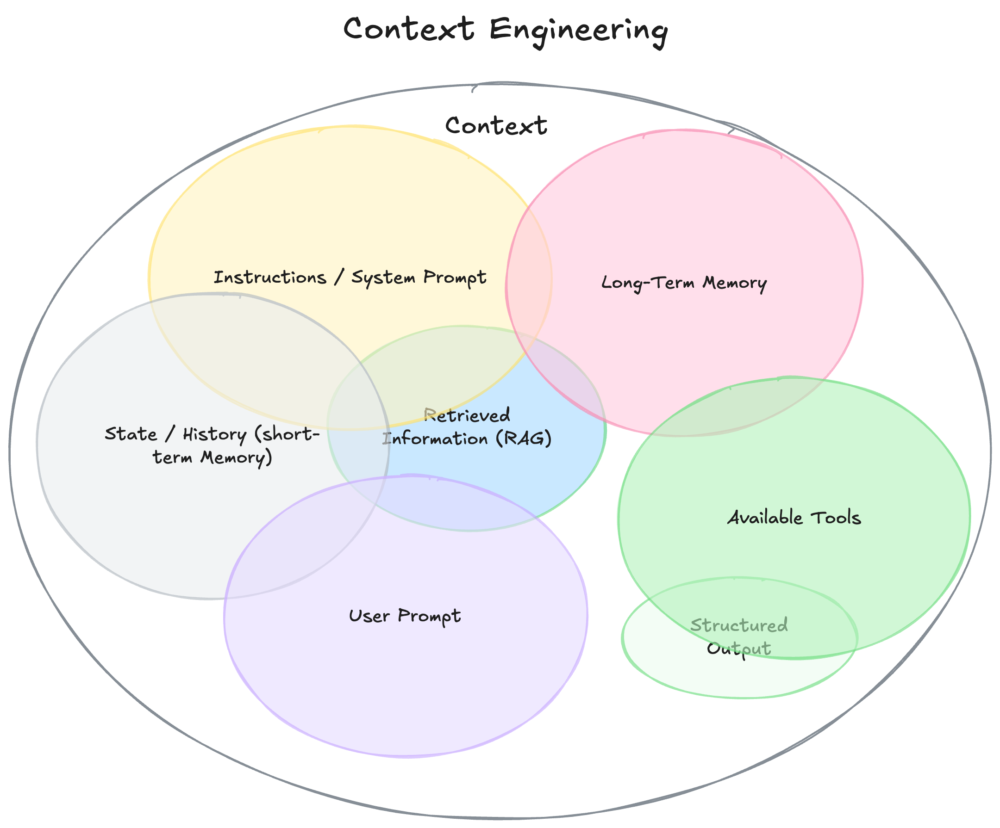
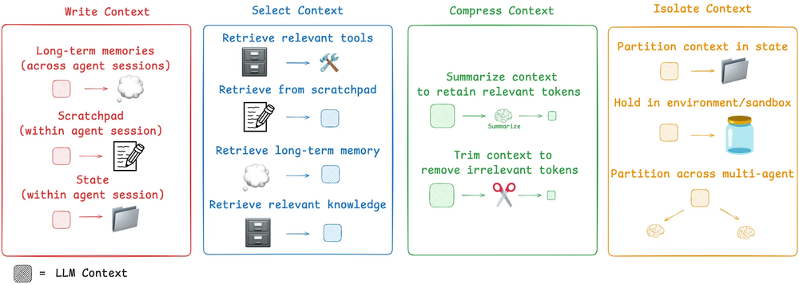
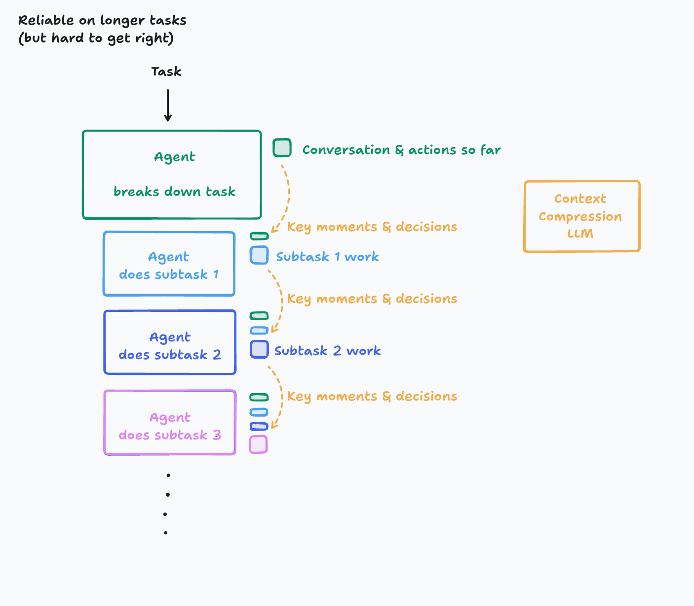

# Context Engineering

## Papers

- [A Survey of Context Engineering for Large Language Models] https://arxiv.org/abs/2507.13334

## Blogs

- https://www.dbreunig.com/2025/06/22/how-contexts-fail-and-how-to-fix-them.html?ref=blog.langchain.com
- https://www.dbreunig.com/2025/06/26/how-to-fix-your-context.html
- https://www.anthropic.com/engineering/built-multi-agent-research-system
- https://manus.im/blog/Context-Engineering-for-AI-Agents-Lessons-from-Building-Manus

## Repository:

- https://github.com/langchain-ai/context_engineering
- https://github.com/davidkimai/Context-Engineering
- https://github.com/coleam00/context-engineering-intro
- https://github.com/humanlayer/12-factor-agents?tab=readme-ov-file

## Context Engineering Notes

## 1 - The New Skill in AI is Not Prompting, It's Context Engineering

- <https://www.philschmid.de/context-engineering>

- Context Engineering is the discipline of designing and building dynamic systems that provides the right information and tools, in the right format, at the right time, to give a LLM everything it needs to accomplish a task.

- With the rise of Agents it becomes more important what information we load into the “limited working memory”. We are seeing that the main thing that determines whether an Agents succeeds or fails is the quality of the context you give it

- The magic isn't in a smarter model or a more clever algorithm. It’s in about providing the right context for the right task. This is why context engineering will matter. Agent failures aren't only model failures; they are context failures.

- Context Engineering is the discipline of designing and building dynamic systems that provides the right information and tools, in the right format, at the right time, to give a LLM everything it needs to accomplish a task.

- Context Engineering is:

  - A System, Not a String: Context isn't just a static prompt template. It’s the output of a system that runs before the main LLM call.

  - Dynamic: Created on the fly, tailored to the immediate task. For one request this could be the calendar data for another the emails or a web search.

  - About the right information, tools at the right time: The core job is to ensure the model isn’t missing crucial details ("Garbage In, Garbage Out"). This means providing both knowledge (information) and capabilities (tools) only when required and helpful.

  - where the format matters: How you present information matters. A concise summary is better than a raw data dump. A clear tool schema is better than a vague instruction.

## 2 - The rise of "context engineering"

- https://blog.langchain.com/the-rise-of-context-engineering/

- “prompts” to “context”? Early on, developers focused on phrasing prompts cleverly to coax better answers. But as applications grow more complex, it’s becoming clear that providing complete and structured context to the AI is far more important than any magic wording.

- prompt engineering is a subset of context engineering. Even if you have all the context, how you assemble it in the prompt still absolutely matters. The difference is that you are not architecting your prompt to work well with a single set of input data, but rather to take a set of dynamic data and format it properly.

## 3 - Context Engineering - langchain blog

link : https://blog.langchain.com/context-engineering-for-agents/

- Andrej Karpathy puts it, LLMs are like a new kind of operating system. The LLM is like the CPU and its context window is like the RAM, serving as the model’s working memory. Just like RAM, the LLM context window has limited capacity to handle various sources of context. And just as an operating system curates what fits into a CPU’s RAM, we can think about “context engineering”

- Long-running tasks and accumulating feedback from tool calls mean that agents often utilize a large number of tokens. This can cause numerous problems: it can exceed the size of the context window, balloon cost / latency, or degrade agent performance. Drew Breunig nicely outlined a number of specific ways that longer context can cause perform problems, including:

  - Context Poisoning: When a hallucination makes it into the context
  - Context Distraction: When the context overwhelms the training
  - Context Confusion: When superfluous context influences the response
  - Context Clash: When parts of the context disagree

- A few common patterns seen across many popular agents today:
  - Writing context - saving it outside the context window to help an agent perform a task.
  - Selecting context - pulling it into the context window to help an agent perform a task.
  - Compressing context - retaining only the tokens required to perform a task.
  - Isolating context - splitting it up to help an agent perform a task.

## Don’t Build Multi-Agents

- https://cognition.ai/blog/dont-build-multi-agents#applying-the-principles

- Principle 1 : Share context, and share full agent traces, not just individual messages

- Principle 2 : Actions carry implicit decisions, and

- new LLM model whose key purpose is to compress a history of actions & conversation into key details, events, and decisions. This is hard to get right. It takes investment into figuring out what ends up being the key information and creating a system that is good at this. Depending on the domain, you might even consider fine-tuning a smaller model (this is in fact something we’ve done at Cognition).

The benefit you get is an agent that is effective at longer contexts. You will still eventually hit a limit though. For the avid reader, I encourage you to think of better ways to manage arbitrarily long contexts. It ends up being quite a deep rabbit hole!

