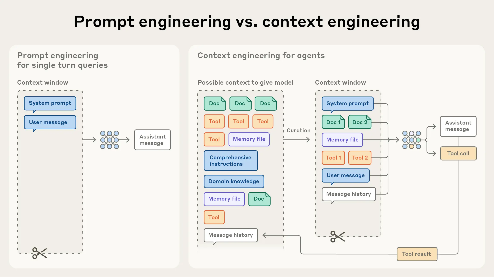

# Mix Notes

## Effective context engineering for AI agents

- https://www.anthropic.com/engineering/effective-context-engineering-for-ai-agents

- At Anthropic, we view context engineering as the natural progression of prompt engineering. Prompt engineering refers to methods for writing and organizing LLM instructions for optimal outcomes (see our docs for an overview and useful prompt engineering strategies). Context engineering refers to the set of strategies for curating and maintaining the optimal set of tokens (information) during LLM inference, including all the other information that may land there outside of the prompts.

- we move towards engineering more capable agents that operate over multiple turns of inference and longer time horizons, we need strategies for managing the entire context state (system instructions, tools, Model Context Protocol (MCP), external data, message history, etc).

- Context engineering is the art and science of curating what will go into the limited context window from that constantly evolving universe of possible information.

- Studies on needle-in-a-haystack style benchmarking have uncovered the concept of context rot: as the number of tokens in the context window increases, the model’s ability to accurately recall information from that context decreases.

- As its context length increases, a model's ability to capture these pairwise relationships gets stretched thin, creating a natural tension between context size and attention focus. Additionally, models develop their attention patterns from training data distributions where shorter sequences are typically more common than longer ones. This means models have less experience with, and fewer specialized parameters for, context-wide dependencies.
Like humans, who have limited working memory capacity, LLMs have an “attention budget” that they draw on when parsing large volumes of context. Every new token introduced depletes this budget by some amount, increasing the need to carefully curate the tokens available to the LLM.
## Context Rot:
- https://research.trychroma.com/context-rot