# Notes

## Book Notes

## Next Token Prediction and Autoregressive Model

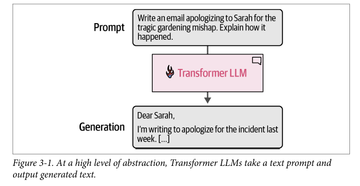

- The most common picture of understanding the behavior of a Transformer LLM is to think of it as a software system that takes in text and generates text in response. Once a large enough text-in-text-out model is trained on a large enough high-quality dataset, it becomes able to generate impressive and useful outputs. Figure 3-1 shows one such model used to author an email.

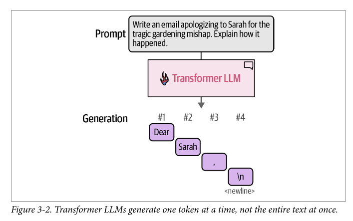

- The model does not generate the text all in one operation; it actually generates one token at a time. Figure 3-2 shows four steps of token generation in response to the input prompt.

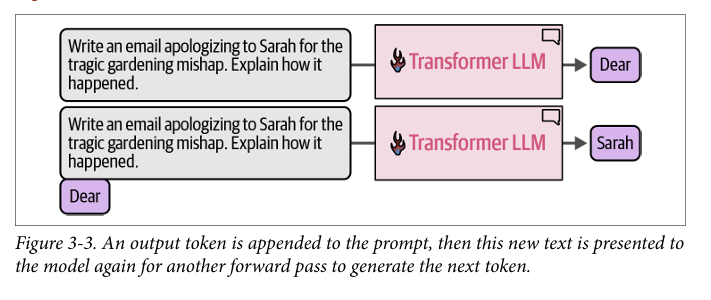

- After each token generation, we tweak the input prompt for the next generation step by appending the output token to the end of the input prompt. We can see this in

- There’s a specific word used in machine learning to describe models that consume their earlier predictions to make later predictions (e.g., the model’s first generated token is used to generate the second token). They’re called autoregressive models. That is why you’ll hear text generation LLMs being called autoregressive models. This is often used to differentiate text generation models from text representation models like BERT, which are not autoregressive.

- Two key internal components are the tokenizer and the language modeling head (LM head).

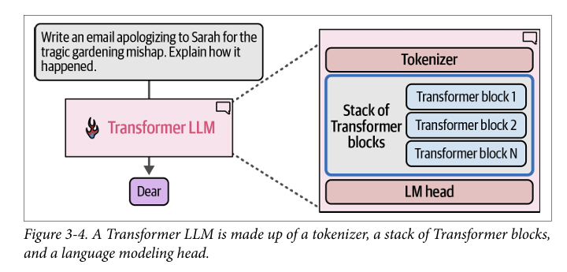

- That stack is then followed by the LM head, which translates the output of the stack into probability scores for what the most likely next token is.

- The tokenizer contains a table of tokens—the tokenizer’s vocabulary. The model has a vector representation associated with each of these tokens in the vocabulary (token embeddings). Figure 3-5 shows both the vocabulary and associated token embeddings for a model with a vocabulary of 50,000 tokens.

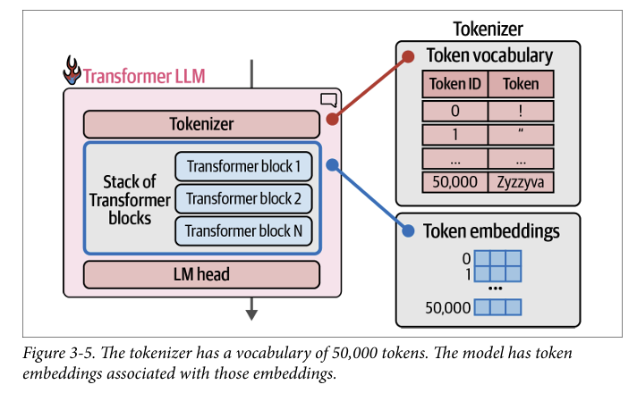

- The process flows once through each of the Transformer blocks in the stack in order, then to the LM head, which finally outputs the probability distribution for the next token, seen in Figure 3-6.

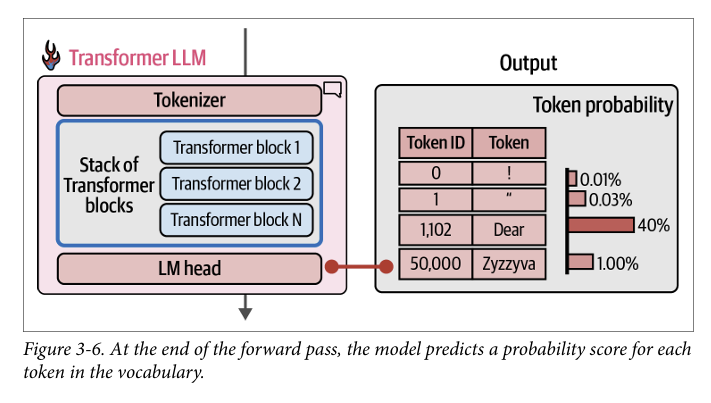

- A stack of Transformer blocks to build different kinds of systems. Other kinds of Transformer heads include sequence classification heads and token classification heads.

- The method of choosing a single token from the probability distribution is called the decoding strategy. The easiest decoding strategy would be to always pick the token with the highest probability score. In practice, this doesn’t tend to lead to the best outputs for most use cases. A better approach is to add some randomness and sometimes choose the second or third highest probability token. The idea here is to basically sample from the probability distribution based on the probability score, as the statisticians would say.

- Choosing the highest scoring token every time is called greedy decoding. It’s what happens if you set the temperature parameter to zero in an LLM.

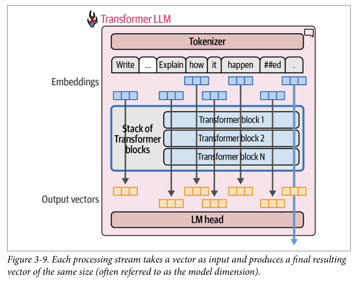

- Current Transformer models have a limit for how many tokens they can process at once. That limit is called the model’s context length. A model with 4K context length can only process 4K tokens and would only have 4K of these streams.

- For text generation, only the output result of the last stream is used to predict the next token.

- we go through the trouble of calculating all the token streams if we’re discarding the outputs of all but the last token. The answer is that the calculations of the previous streams are required and used in calculating the final stream. Yes, we’re not using their final output vector, but we use earlier outputs (in each Transformer block) in the Transformer block’s attention mechanism.

## Transformer and Attention

- A Transformer block (Figure 3-12) is made up of two successive components: 1.The attention layer is mainly concerned with incorporating relevant information 1. from other input tokens and positions 2.The feedforward layer houses the majority of the model’s processing capacity

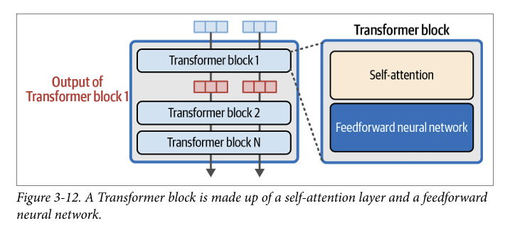

- The feedforward neural network (collectively in all the model layers) is the source of this information, as Figure 3-13 shows. When the model was successfully trained to model a massive text archive (which included many mentions of “The Shawshank Redemption”), it learned and stored the information (and behaviors) that make it succeed at this task.

- Context is vital in order to properly model language. Simple memorization and interpolation based on the previous token can only take us so far.

- Attention is a mechanism that helps the model incorporate context as it’s processing a specific token.

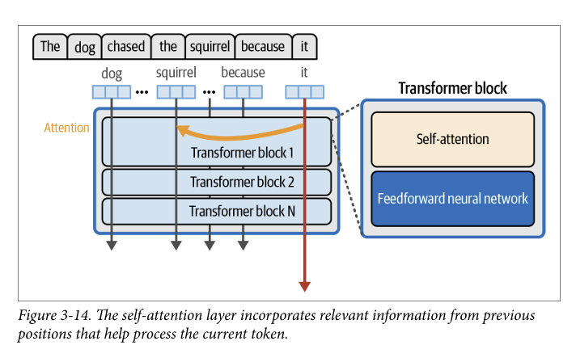

- Two main steps are involved in the attention mechanism: 1. A way to score how relevant each of the previous input tokens are to the current 1. token being processed (in the pink arrow). 2. Using those scores, we combine the information from the various positions into a 2. single output vector.

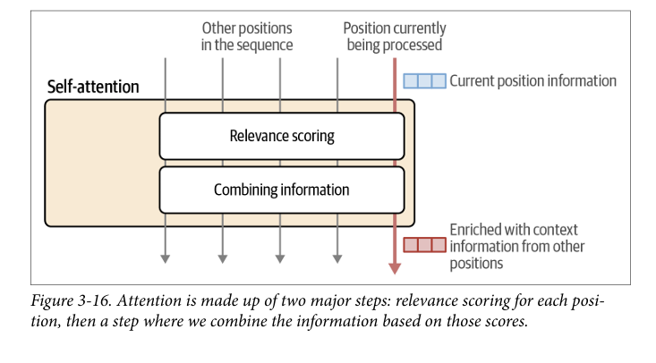

- The training process produces three projection matrices that produce the com• ponents that interact in this calculation: —A query projection matrix — —A key projection matrix — — —A value projection matrix

- Attention starts by multiplying the inputs by the projection matrices to create three new matrices. These are called the queries, keys, and values matrices. These matrices contain the information of the input tokens projected to three different spaces that help carry out the two steps of attention: 1. Relevance scoring 2. 1. 2. Combining information

- The relevance scoring step of attention is conducted by multiplying the query vector of the current position with the keys matrix. This produces a score stating how relevant each previous token is. Passing that by a softmax operation normalizes these scores so they sum up to 1. Figure 3-20 shows the relevance score resulting from this calculation.

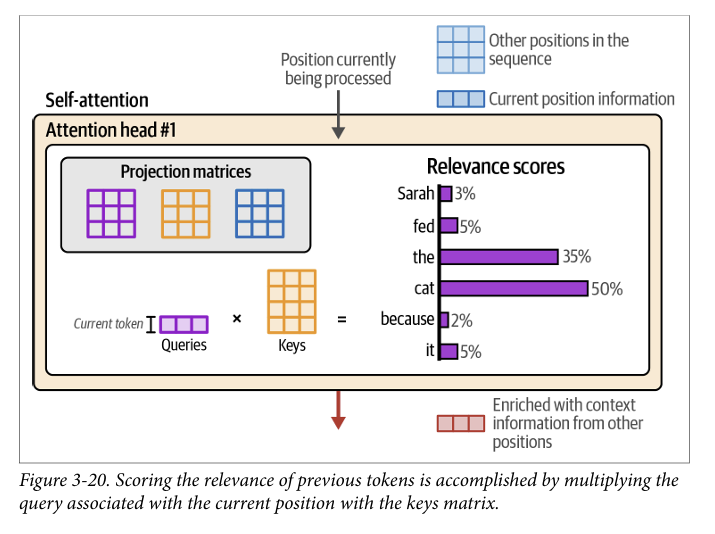

- We multiply the value vector associated with each token by that token’s score. Summing up those resulting vectors produces the output of this attention step, as we see in Figure 3-21

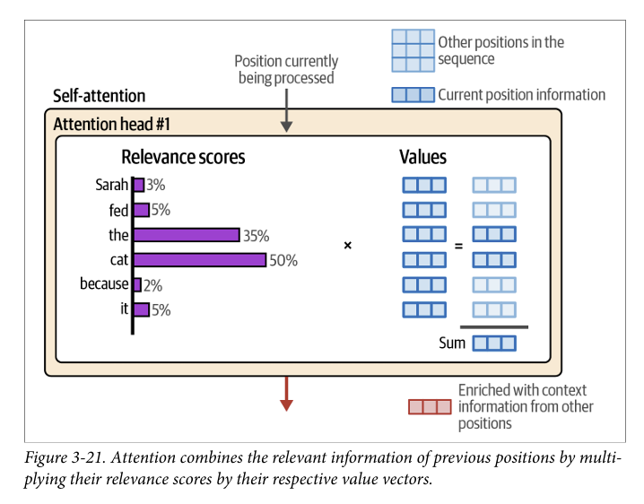

**Summary**

Summary In this chapter we discussed the main intuitions of Transformers and recent developments that enable the latest Transformer LLMs. We went over many new concepts, so let’s break down the key concepts that we discussed in this chapter:

• • A Transformer LLM generates one token at a time.

• • That output token is appended to the prompt, then this updated prompt is presented to the model again for another forward pass to generate the next token.

• • The three major components of the Transformer LLM are the tokenizer, a stack of Transformer blocks, and a language modeling head.

• • The tokenizer contains the token vocabulary for the model. The model has token embeddings associated with those tokens. Breaking the text into tokens and then using the embeddings of these tokens is the first step in the token generation process.

• • The forward pass flows through all the stages once, one by one.

• • Near the end of the process, the LM head scores the probabilities of the next possible token. Decoding strategies inform which actual token to pick as the output for this generation step (sometimes it’s the most probable next token, but not always).

• • One reason the Transformer excels is its ability to process tokens in parallel. Each of the input tokens flow into their individual tracks or streams of processing. The number of streams is the model’s “context size” and this represents the max number of tokens the model can operate on.

• • The majority of processing happens within Transformer blocks. These are made up of two components. One of them is the feedforward neural network, which is able to store information and make predictions and interpolations from data it was trained on.

• • The second major component of a Transformer block is the attention layer. Attention incorporates contextual information to allow the model to better capture the nuance of language.

• • Attention happens in two major steps: (1) scoring relevance and (2) combining information.

• A Transformer attention layer conducts several attention operations in parallel,each occurring inside an attention head, and their outputs are aggregated to make up the output of the attention layer.

• Attention can be accelerated via sharing the keys and values matrices between all heads, or groups of heads (grouped-query attention).

**Data Flow in LLMs**

Input Text
    ↓
┌─────────────┐
│ Tokenizer   │ ← Ayrı component (vocabulary table)
└─────────────┘
    ↓ Token IDs
┌─────────────┐
│             │
│ Embedding   │ ← LLM içinde (learnable matrix)
│ Layer       │
│             │
└─────────────┘
    ↓ Embeddings
┌─────────────┐
│ Positional  │ ← LLM içinde (position info)
│ Encoding    │
└─────────────┘
    ↓ Position-aware embeddings  
┌─────────────┐
│ Transformer │ ← LLM core
│ Blocks      │
└─────────────┘
    ↓ Contextualized representations
┌─────────────┐
│ LM Head     │ ← Final layer
└─────────────┘
    ↓ Probability distribution

## Prompt and Context Learning

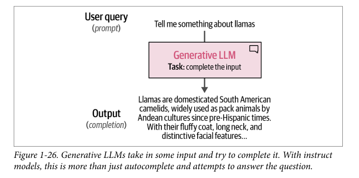

- Promopts are the input text that we provide to the LLM to generate a response. They can be simple questions, instructions, or any text that guides the model's output.

- A vital part of these completion models is something called the context length or context window. The context length represents the maximum number of tokens the model can process, as shown in Figure 1-27. A large context window allows entire documents to be passed to the LLM. Note that due to the autoregressive nature of these models, the current context length will increase as new tokens are generated.

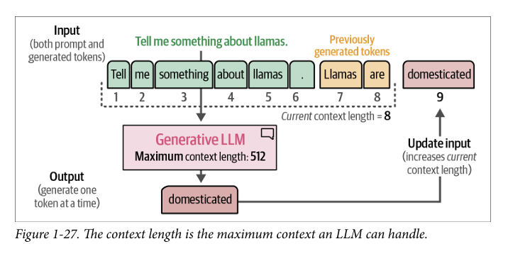

- Through prompt engineering, we can design these prompts in a way that enhances the quality of the generated text.

- You may recognize the special tokens <|user|> and <|assistant|> from Chapter 2. This prompt template, further illustrated in Figure 6-2, was used during the training of the model. Not only does it provide information about who said what, but it is also used to indicate when the model should stop generating text (see the <|end|> token). This prompt is passed directly to the LLM and processed all at once.

- Prompt templates are a powerful tool for controlling the behavior of LLMs. They allow us to specify the format and structure of the input text, which can significantly impact the quality and relevance of the generated output.

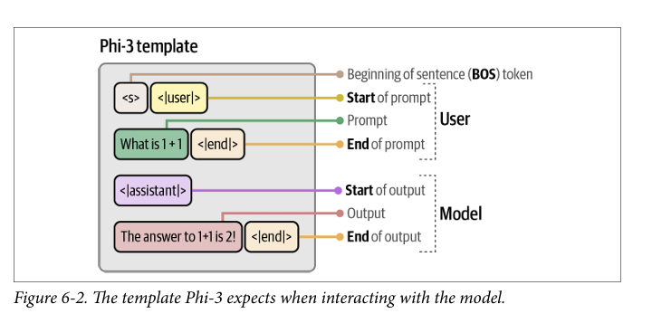

- Used several parameters in the pipe function, including temperature and top_p. These parameters control the randomness of the output. A part of what makes LLMs exciting technology is that it can generate different responses for the exact same prompt.  Each time an LLM needs to generate a token, it assigns a likelihood number to each possible token.

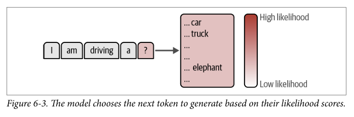

- The temperature controls the randomness or creativity of the text generated. It defines how likely it is to choose tokens that are less probable. The underlying idea is that a temperature of 0 generates the same response every time because it always chooses the most likely word.

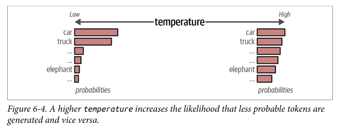

- top_p, also known as nucleus sampling, is a sampling technique that controls which subset of tokens (the nucleus) the LLM can consider. It will consider tokens until it reaches their cumulative probability. If we set top_p to 0.1, it will consider tokens until it reaches that value. If we set top_p to 1, it will consider all tokens.

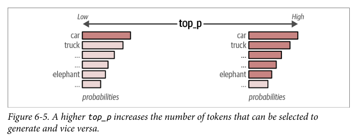

- the main goal of prompt engineering is to elicit a useful response from the model. Prompt engineering is more than designing effective prompts. It can be used as a tool to evaluate the output of a model as well as to design safeguards and safety mitigation methods. This is an iterative process of prompt optimization and requires experimentation. There is not and unlikely will ever be a perfect prompt design.

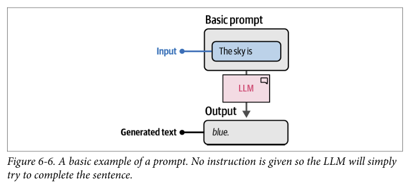

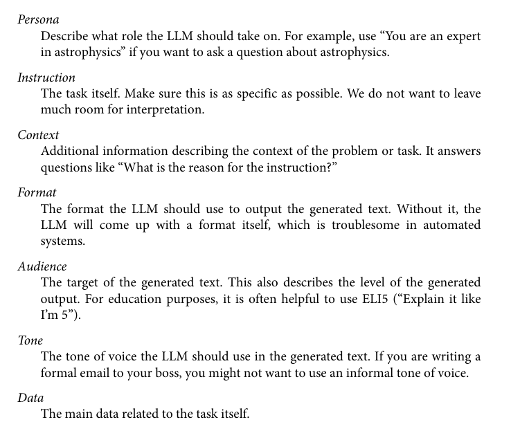66

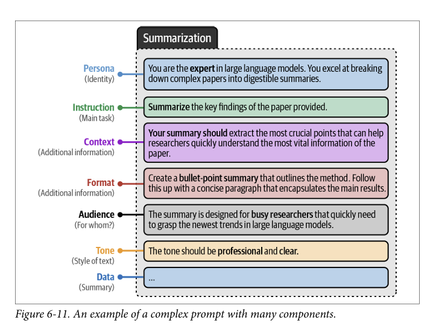

## Tokens ans Embeddings

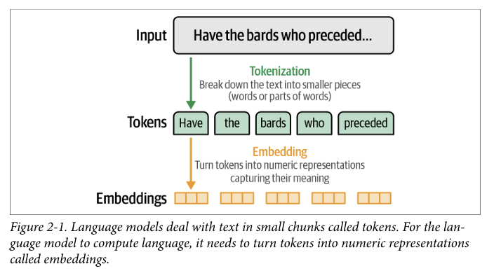

- Tokens aren’t only the output of a model, they’re also the way in which the model sees its inputs.

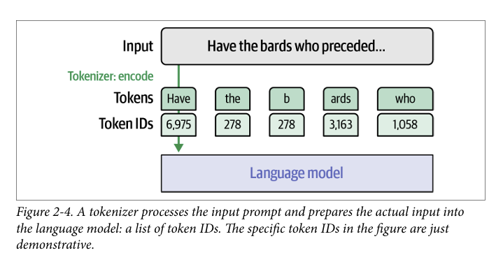

- On the output side, we can also inspect the tokens generated by the model by printing the generation_output variable. This shows the input tokens as well as the output tokens

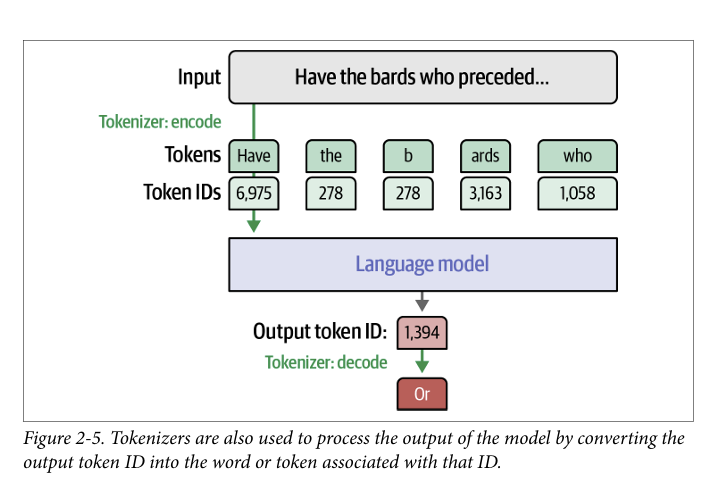

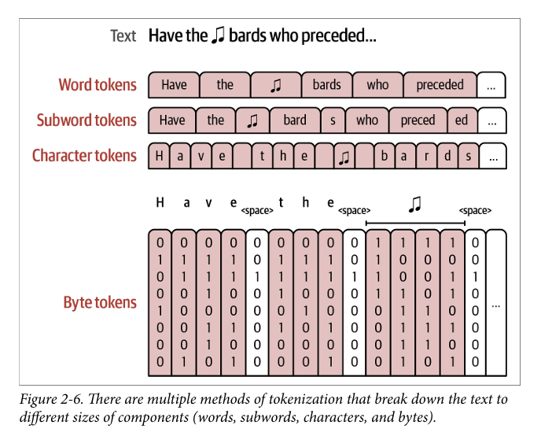

## Foundation Model

-  These open source base models are often referred to as foundation models and can be fine-tuned for specific tasks, like following instructions.
