Here's the edited version of the README and diagram based on your request:

---

# RAG Project

This project demonstrates the implementation of a **Retrieval Augmented Generation (RAG)** system using the LangChain framework and Chroma vector store.

## Overview

The RAG system combines the power of large language models (LLMs) with document retrieval capabilities from vector stores. This system enables querying documents, retrieving relevant information, and generating more accurate responses. Additionally, the project integrates a PostgreSQL database to store prediction results and a Grafana dashboard for monitoring and visualization.

## Components

### Web Documents

The initial data source, where documents (e.g., web pages) are stored for the RAG system.

### Document Loader

The `DocumentLoader` class loads documents from web sources or other inputs.

### Document Processor

The `DocumentProcessor` class processes loaded documents by splitting them into manageable chunks.

### Chroma Vector Store

The `VectorStore` class connects with the Chroma vector store, storing and retrieving document embeddings.

### Retriever

The `Retriever` component fetches relevant documents from the vector store based on a user's query.

### RAG System

The `RAG` class combines the Retriever and Language Model to generate a response based on the retrieved documents.

### Language Model

The LLM is used to generate responses, leveraging retrieved document information.

### PostgreSQL Database

Stores the RAG system’s predictions, including queries, responses, and relevant metrics.

### Grafana Dashboard

A visualization tool that displays performance data and usage metrics from the PostgreSQL database.

## Architecture Diagram

```mermaid
flowchart TD
    subgraph A["Embedding Creation"]
        A1[📄 Load Documents] --> A2[🔄 Split Documents]
        A2 --> A3[📦 Create Embeddings]
        A3 --> A4[💾 Store in Vector Store]
    end
    
    subgraph B["Retriever and Generation"]
        B1[🔍 Query Retriever] --> B2[📡 Retrieve Relevant Embeddings]
        B2 --> B3[🧠 Generate Response via LLM]
    end
    
    User[👤 User Query] --> B1
    B3 --> Response[💬 Response to User]
    
    A4 --- B2
```

Architecture diagram of the RAG system:



### Key Features:
1. **Embedding Creation**: Documents are loaded, split into smaller parts, and embeddings are generated and stored in a vector store.
2. **Retriever and Generation**: User queries retrieve document embeddings, passed to the LLM, which generates a response.
3. **Flow and Interaction**: Modern icons and flows represent user interaction, document processing, and system response, making the diagram dynamic and engaging.

## Setup

1. **Clone the repository**

2. **Set up the environment**:
   ```bash
   python -m venv venv
   source venv/bin/activate
   pip install -r requirements.txt
   ```

3. **Start Docker services**:
   Start the Chroma DB, PostgreSQL, and Grafana services using Docker Compose.

4. **Configure the environment**:
   Rename `.env.example` to `.env` and update the necessary environment variables.

## .env File

Here is an example of the `.env` file:

```
OPENAI_API_KEY=sk-...
CHROMA_PORT=8000
POSTGRES_DB=rag_db
POSTGRES_USER=admin
POSTGRES_PASSWORD=admin123
POSTGRES_PORT=5432
GRAFANA_ADMIN_USER=admin
GRAFANA_ADMIN_PASSWORD=admin
GRAFANA_PORT=3000
```

Make sure to replace the placeholder values with your actual credentials.

## Usage

1. **Load and Process Documents**:
   Use the `DocumentLoader` and `DocumentProcessor` to load and prepare documents.

2. **Create the Vector Store**:
   Generate embeddings from processed documents and store them using the `VectorStore` class.

3. **Run the RAG System**:
   Initialize and execute the `RAG` class, generate responses, and store predictions in the PostgreSQL database.

4. **Monitoring**:
   Use Grafana to visualize the RAG system's performance, based on the data stored in PostgreSQL.

---

This modernized documentation provides a clear understanding of the RAG system with an improved diagram and flow description.