# RAG Project

This project demonstrates the implementation of a **Retrieval Augmented Generation (RAG)** system using the LangChain framework and Chroma vector store. The system combines the power of large language models (LLMs) with document retrieval capabilities from vector stores, enabling more accurate and informed responses by retrieving relevant information from documents.

## Overview

The RAG system uses document embeddings stored in a vector store to retrieve relevant data based on user queries. The project also integrates a PostgreSQL database to store prediction results, and a Grafana dashboard for monitoring and visualization of the system's performance.

## Components

### Web Documents

The initial data source where documents (e.g., web pages) are stored for the RAG system.

### Document Loader

The `DocumentLoader` class loads documents from web sources or other inputs.

### Document Processor

The `DocumentProcessor` class processes loaded documents by splitting them into manageable chunks to improve embedding performance.

### Chroma Vector Store

The `VectorStore` class connects with the Chroma vector store to store and retrieve document embeddings.

### Retriever

The `Retriever` component fetches relevant documents from the vector store based on user queries.

### RAG System

The `RAG` class combines the Retriever and the Language Model to generate responses based on retrieved documents.

### Language Model (LLM)

The LLM generates responses by leveraging the retrieved document embeddings.

### PostgreSQL Database

Stores the RAG system’s predictions, including user queries, responses, and relevant metrics like response time and token usage.

### Grafana Dashboard

A visualization tool that displays performance data and usage metrics from the PostgreSQL database.

### Docker Services

The system utilizes Docker to orchestrate services for the Chroma vector store, PostgreSQL, and Grafana dashboard.

## Architecture Diagram

```mermaid
flowchart TD
    subgraph A["Embedding Creation"]
        A1[📄 Load Documents] --> A2[🔄 Split Documents]
        A2 --> A3[📦 Create Embeddings]
        A3 --> A4[💾 Store in Vector Store]
    end
    
    subgraph B["Retriever and Generation"]
        B1[🔍 Query Retriever] --> B2[📡 Retrieve Relevant Embeddings]
        B2 --> B3[🧠 Generate Response via LLM]
    end
    
    User[👤 User Query] --> B1
    B3 --> Response[💬 Response to User]
    
    A4 --- B2
```



### Key Features:
1. **Embedding Creation**: Documents are loaded and split into smaller parts, and embeddings are generated and stored in a vector store.
2. **Retriever and Generation**: User queries are used to retrieve relevant document embeddings, which are then passed to the LLM for response generation.
3. **Flow and Interaction**: Modern icons and flow lines represent user interaction, document processing, and system response, making the diagram dynamic and easy to follow.

## Setup

1. **Clone the repository**:
   ```bash
   git clone https://github.com/your-username/rag-project.git
   cd rag-project
   ```

2. **Set up the environment**:
   ```bash
   python -m venv venv
   source venv/bin/activate
   pip install -r requirements.txt
   ```

3. **Start Docker services**:
   Use Docker Compose to start the services:
   ```bash
   docker-compose up -d
   ```

4. **Configure the environment**:
   Rename `.env.example` to `.env` and update the necessary environment variables.

## .env File

Here is an example of the `.env` file:

```env
OPENAI_API_KEY=sk-...
CHROMA_PORT=8000
POSTGRES_DB=rag_db
POSTGRES_USER=admin
POSTGRES_PASSWORD=admin123
POSTGRES_PORT=5432
GRAFANA_ADMIN_USER=admin
GRAFANA_ADMIN_PASSWORD=admin
GRAFANA_PORT=3000
```

Make sure to replace the placeholder values with your actual credentials.

## Analyzing and Running the Project

You can test and run the RAG system using the provided Jupyter notebook `rag.ipynb`. This notebook demonstrates the entire process, from creating embeddings to querying the system and generating responses.

### Step-by-Step Instructions:

1. **First Part: Creating Embeddings and Saving to Vector Store**

   In the first section of the notebook, embeddings are created from web documents and saved to the vector store:

   ```python
   from src.config import Config
   from src.document import DocumentLoader, DocumentProcessor
   from src.vector_store import VectorStore

   config = Config()

   # Load documents from web
   web_paths = [
       "https://lilianweng.github.io/posts/2024-07-07-hallucination/",
       "https://lilianweng.github.io/posts/2023-10-25-adv-attack-llm/",
       # Add more URLs as needed
   ]
   docs = DocumentLoader.load_web_documents(web_paths)

   # Process documents
   processor = DocumentProcessor()
   split_docs = processor.split_documents(docs)

   # Create vector store and add documents
   vector_store = VectorStore()
   vector_store.add_documents(split_docs)
   ```

2. **Second Part: Running the Retriever and LLM**

   After storing embeddings, you can run the retriever and LLM to answer a question:

   ```python
   from src.rag import RAG
   from src.vector_store import VectorStore
   from src.llm import LLM

   # Instantiate the retriever and LLM
   vector_store = VectorStore()
   retriever = vector_store.get_retriever()

   llm = LLM()

   # Initialize the RAG system
   rag = RAG(retriever, llm)

   # Ask a question and retrieve an answer
   question = "What is an AI agent?"
   answer, answer_data, conversation_id = rag.run(question)
   print(f"Answer: {answer}")
   ```

3. **Running the Notebook**

   - Open the notebook (`rag.ipynb`) in Jupyter and run each cell step-by-step to see how the RAG system processes documents, stores embeddings, and retrieves answers using the LLM.

## Monitoring with Grafana

Once the RAG system is running and storing data, you can visualize its performance using Grafana:

1. Access Grafana at `http://localhost:3000`.
2. Log in with the credentials from your `.env` file (default: admin/admin).
3. Use the pre-configured dashboard to monitor query response times, token usage, and more.

## Docker Services Setup

The services are defined in the `docker-compose.yaml` file:

- **Chroma DB**: Stores and retrieves document embeddings.
- **PostgreSQL**: Stores the RAG system’s prediction results and metrics.
- **Grafana**: Provides a dashboard for performance monitoring.

```yaml
version: '3.8'

services:
  chroma_db:
    image: ghcr.io/chroma-core/chroma:latest
    volumes:
      - chroma_data:/chroma/chroma
    ports:
      - "${CHROMA_PORT:-8000}:8000"

  postgres:
    image: postgres:13
    environment:
      POSTGRES_DB: ${POSTGRES_DB:-rag_db}
      POSTGRES_USER: ${POSTGRES_USER:-admin}
      POSTGRES_PASSWORD: ${POSTGRES_PASSWORD:-admin123}
    ports:
      - "${POSTGRES_PORT:-5432}:5432"

  grafana:
    image: grafana/grafana:latest
    environment:
      - GF_SECURITY_ADMIN_USER=${GRAFANA_ADMIN_USER:-admin}
      - GF_SECURITY_ADMIN_PASSWORD=${GRAFANA_ADMIN_PASSWORD:-admin}
    ports:
      - "${GRAFANA_PORT:-3000}:3000"

networks:
  rag_network:
    driver: bridge

volumes:
  chroma_data:
  postgres_data:
  grafana_data:
```

---

